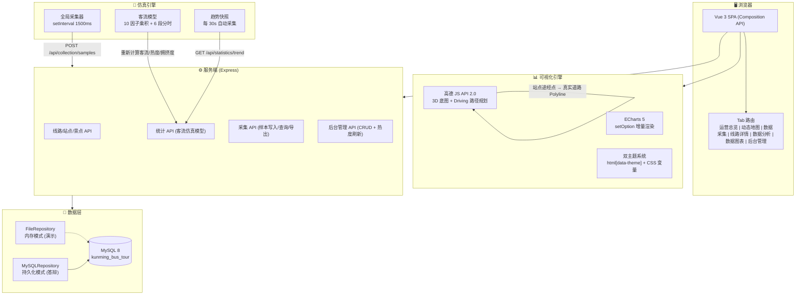
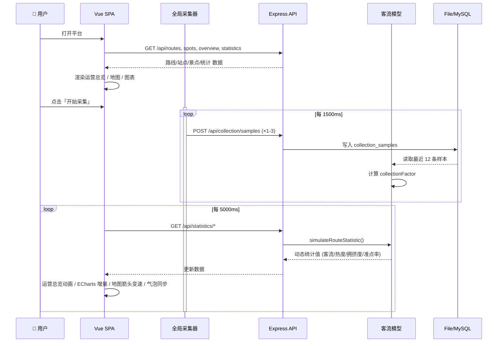
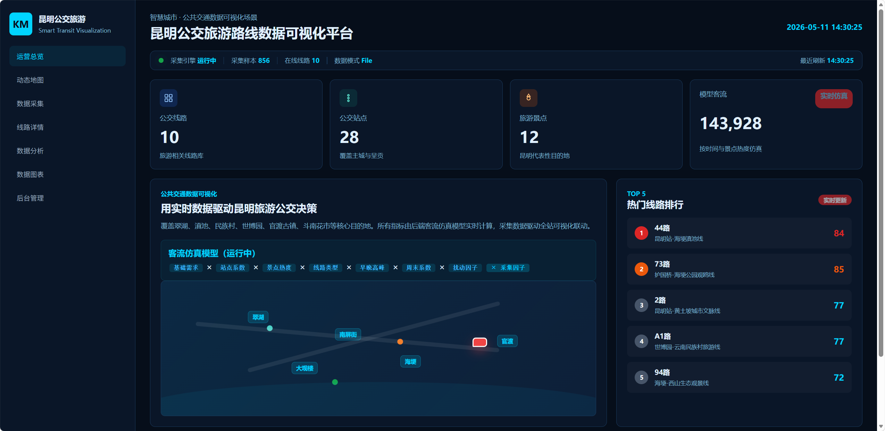
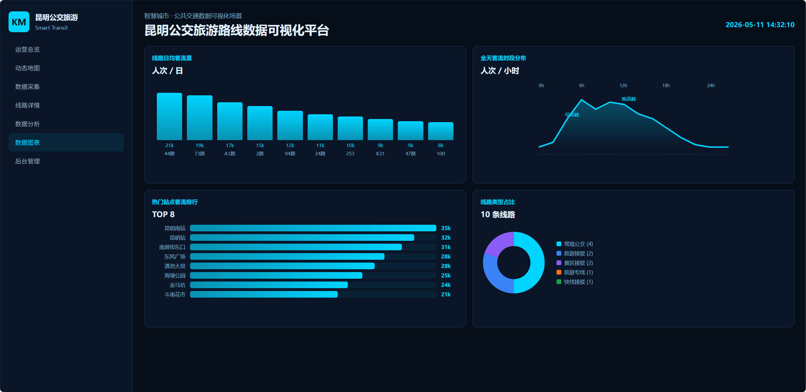
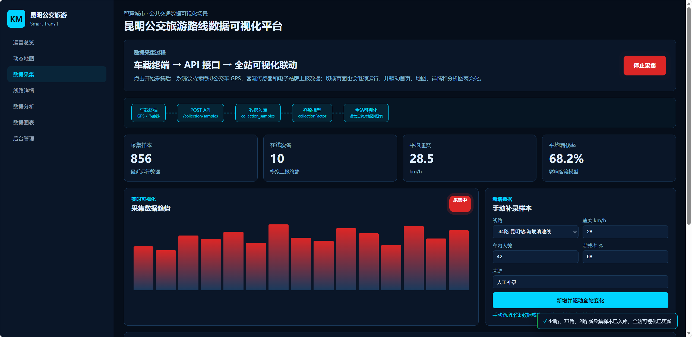
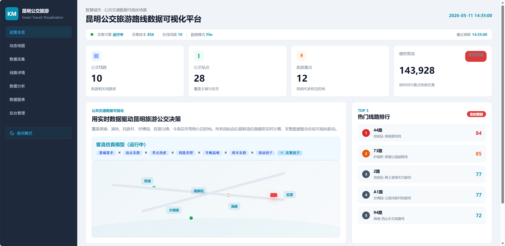

# 昆明公交旅游路线数据可视化平台 — 前期准备

| 属性 | 内容 |
| --- | --- |
| 文档编号 | KM-BUS-PREP-001 |
| 文档版本 | V5.0 |
| 制定日期 | 2026-05-26 |
| 项目名称 | 昆明公交旅游路线数据可视化平台 |
| 项目类型 | 实训全栈 Web 项目 |

---

## 一、项目愿景与目标

### 1.1 我们要做成什么样子

构建一个**智慧交通大屏风格**的公交旅游路线数据可视化平台，模拟昆明市公共交通数据监控中心的真实业务场景。

**核心体验目标**：

**游客端**（`/tourist.html`）：
- 手绘 scrapbook 美学风格，与景点导览页视觉统一
- 高德地图展示 10 条公交线路和 12 个景点，彩色箭头沿真实道路同步移动
- 景点卡片可展开查看完整游玩攻略（怎么玩/体验什么/最佳时节）
- 全程无需登录，看不到任何管理功能

**管理员端**（`/`，需登录）：
- 深蓝科技风大屏，模拟城市交通指挥中心
- 左侧导航面板，中间高德 3D 地图，右侧遥测面板和 ECharts 图表
- 点击"开始采集"，系统自动模拟车载终端上报数据，全站可视化联动刷新
- 支持暗色/白天双主题一键切换
- JWT 登录认证，管理员与游客权限分离

### 1.2 核心业务场景

```text
游客浏览景点 → 查看公交线路 → 在地图上追踪车辆 → 点击景点看攻略
管理员登录 → 监控客流 → 采集数据 → 分析图表 → 管理线路
```

### 1.3 功能全景

#### 游客端（无需登录）

| 模块 | 功能 |
| --- | --- |
| 动态地图 | 高德 3D 底图 + AMap.Driving 真实道路路径、10 线箭头同步运行、高亮/淡化交互、站点点击弹窗、景点标注详情 |
| 景点浏览 | 12 个景点卡片网格（手绘 scrapbook 风格）、点击展开游玩攻略（怎么玩/体验什么/最佳时节）、路线提示 |
| 线路浏览 | 10 条公交旅游线路卡片、途经站点展示、沿线景点关联 |
| 景点导览 Landing | 独立手绘风格 Landing 页（landing.html），12 个景点卡片 + 真实图片 + 一键跳转游客导览页 + URL 参数深链联动 |

#### 管理员端（需要登录）

| 模块 | 功能 |
| --- | --- |
| 运营总览 | KPI 指标面板（线路数/站点数/景点数/动态客流）、TOP 5 热门线路排行、路线卡片网格、客流仿真模型展示 |
| 动态地图 | 高德 3D 底图 + AMap.Driving 真实道路路径、10 线 SVG 箭头同步运行、高亮/淡化交互、3 视角切换（自由/跟随/车内）、速率滑动条、遥测面板、站点点击弹窗、跟随气泡（当前站→下一站） |
| 数据采集 | 全局采集引擎（1500ms 持续运行）、手动补录表单、ECharts 趋势图、遥测指标面板（脉冲动画）、数据管道动效 |
| 线路详情 | 站点时间线、运营指标面板、关联景点列表 |
| 数据分析 | 客流排行柱状图、景点热度柱状图、区域分布饼图、拥挤度-准点率双线图（全部 setOption 增量平滑过渡） |
| 数据图表 | 线路客流柱状图、时段折线图、站点排行横向柱状图、线路类型占比饼图（MutationObserver 主题自动重绘） |
| 后台管理 | 线路新增/删除、线路列表维护、景点热度手动刷新 |
| 系统特性 | Toast 通知栈、全局状态栏（含实时时钟 + 样本计数 + 数据模式）、骨架屏加载、暗色/白天双主题、日夜切换（日月图标）、CSV 数据导出、趋势快照 API、JWT 登录认证 |

### 1.4 系统架构流程图



### 1.5 数据采集与可视化联动流程



### 1.6 参考效果图


#### 运营总览（暗色模式）


*暗色模式下运营总览页面：KPI 指标面板 + TOP5 热门排行 + 路线卡片 + 客流模型展示*

#### 动态地图（高德 3D + 全线路箭头）


*10 条线路 SVG 箭头同步运行，高亮线路显示遥测面板 + 跟随气泡（当前站→下一站）*

#### 数据图表


*4 个 ECharts 图表 2x2 布局 + 线路筛选 + 主题自适应*

#### 数据采集


*采集管道动效 + 实时趋势图 + 遥测指标面板 + Toast 通知*

#### 白天模式


*白天模式下的运营总览，侧边栏保持深色 + 日月图标切换*

---

## 二、技术栈

### 2.1 前端

| 技术 | 版本 | 用途 |
| --- | --- | --- |
| Vue 3 (Composition API) | 3.5 | SPA 组件化框架 |
| TypeScript | 5.x | 类型安全 |
| Vite | 5.x | 构建工具与开发服务器 |
| ECharts | 5.6 | 客流/热度/拥挤度/采集趋势可视化（原生写法，不用 vue-echarts） |
| 高德 JS API | 2.0 | 3D 底图 + Driving 驾车路径规划 + HeatMap 热力图 |
| Leaflet | 1.9 | 辅助地图库（备用方案） |
| Element Plus | 2.14 | UI 组件库（表单、按钮、图标） |
| CSS3 | — | 自定义双主题系统（`html[data-theme]` 属性选择器），暗色深蓝黑 + 白天浅灰白 |

### 2.2 后端

| 技术 | 版本 | 用途 |
| --- | --- | --- |
| Node.js | 18+ | 运行时 |
| Express.js | 4.x | REST API 框架 |
| mysql2/promise | 3.x | MySQL 连接池驱动 |

### 2.3 数据库

| 技术 | 版本 | 用途 |
| --- | --- | --- |
| MySQL | 8.0 | 持久化存储（可选，默认 File 内存模式） |

### 2.4 仿真模型

- 客流公式：`baseDemand × stopFactor × spotHeatFactor × typeFactor × timeFactor × weekendFactor × weatherFactor × randomFactor × tickJitter × collectionFactor`
- 6 段分时因子：深夜 0.10 / 清晨 0.35 / 早高峰 1.35 / 白天 0.85 / 晚高峰 1.25 / 晚间 0.40
- 采集因子：`0.82 + avgLoadRate/100 × 0.36 + avgPassengerCount/220`
- 秒级动态抖动：tickJitter 毫秒级种子 + 分钟级分量

### 2.5 工具链

| 工具 | 用途 |
| --- | --- |
| VS Code | 开发编辑器 |
| Chrome DevTools | 调试与性能分析 |
| Git | 版本控制 |
| npm | 包管理 |

---

## 三、参考原型项目

### 3.1 主要参考：bus-vis

| 项目 | 说明 |
| --- | --- |
| 名称 | bus-vis |
| 作者 | ddiu8081 |
| 仓库 | [https://github.com/ddiu8081/bus-vis](https://github.com/ddiu8081/bus-vis) |
| 许可 | MIT License |
| 简介 | 基于百度地图的公交数据可视化作品，展示了线路网展示、站点信息交互和城市公交数据表达的产品思路 |

### 3.2 借鉴内容与独立实现对比

| 维度 | bus-vis（参考源） | 本系统（独立实现） |
| --- | --- | --- |
| 地图平台 | 百度地图 | 高德 JS API 2.0 |
| 主题定位 | 通用城市公交可视化 | 昆明公交旅游主题 |
| 后端 | 无（纯前端） | Express + MySQL + RESTful API |
| 数据库 | 无 | MySQL 8，7 张核心业务表 |
| 数据采集 | 无 | 全局仿真采集器 + 客流模型 + 采集因子 |
| 客流模型 | 无 | 10 因子乘积模型 + 分时系数 + tickJitter |
| 后台管理 | 无 | 线路管理 + 景点热度管理 |
| 路线 | 折线连接 | AMap.Driving 真实道路路径 |
| 车辆标记 | 简单圆点 | SVG chevron 导航箭头 + setAngle 实时转向 |
| 多线路 | 单线路切换 | 10 条线路同屏同步运行 + 高亮/淡化 |
| 视角 | 2D 俯视 | 3 种视角（自由/跟随/车内） |
| 可视化联动 | 静态展示 | 全站数据联动（脉冲动画 + 平滑过渡 + 气泡同步） |
| 主题 | 单一 | 暗色/白天双主题 + 日月图标切换 |
| 地图降级 | 无 Key 不可用 | 自动降级内置地图 |
| 景点集成 | 无 | 昆明 12 景点坐标 + 真实图片 + 详情弹窗 |
| 技术栈 | 前端单页 | Vue 3 + Express + MySQL 前后端分离 |

### 3.3 处理方式

- 未直接复制 bus-vis 源代码，仅借鉴其**产品形态和可视化交互思路**
- 所有代码、数据模型、后端接口、数据库和文档均为围绕昆明公交旅游主题的**独立原创实现**
- 借鉴来源已明确声明，符合学术诚信要求

---

## 四、小组工作规划（8 人）

参照互联网公司敏捷开发流程，将 8 人分为 4 个职能小组，以 **2 周 Sprint** 推进。

### 4.1 组织架构

| 角色 | 人数 | 职责 |
| --- | --- | --- |
| **项目经理 (PM)** | 1 人 | 需求管理、进度跟踪、风险把控、演示汇报、文档统筹 |
| **前端开发组** | 3 人 | Vue 组件开发、地图集成、图表开发、主题系统、交互优化 |
| **后端开发组** | 2 人 | REST API 开发、数据库设计、仿真模型、接口文档 |
| **数据与设计组** | 1 人 | 数据收集整理（线路/站点/景点坐标）、UI 设计、图片素材 |
| **测试与文档组** | 1 人 | 功能测试、接口测试、测试报告、用户手册 |

### 4.2 Sprint 1：基础搭建（第 1 周）

| 任务 | 负责人 | 产出 |
| --- | --- | --- |
| 项目脚手架搭建 | 前端组长 | Vue 3 + Vite + TypeScript 项目初始化，路由规划 |
| 后端框架搭建 | 后端组长 | Express 项目初始化，File Repository 基础 CRUD |
| 数据库设计 | 后端开发 | schema.sql + seed.sql + 数据字典 |
| 静态数据整理 | 数据设计 | 10 条线路 + 28 站点 + 12 景点坐标与属性 |
| UI 设计稿 | 数据设计 | 页面布局 wireframe，配色方案 |
| 需求文档 | PM | 需求分析.md |
| 概要设计 | PM + 后端组长 | 概要设计.md |

**里程碑**：前后端可通信，基础数据可查询，页面骨架可访问。

### 4.3 Sprint 2：核心功能开发（第 2 周前半）

| 任务 | 负责人 | 产出 |
| --- | --- | --- |
| 驾驶舱/运营总览 | 前端 A | KPI 面板 + 热门排行 + 路线卡片 + 客流动画 |
| 动态地图（AMap） | 前端 B | 高德 3D 底图 + 路线 Polyline + 站点 Marker + 箭头动画 |
| 线路详情页 | 前端 C | 站点时间线 + 运营指标面板 + 景点列表 |
| 数据采集引擎 | 后端 A | 全局采集器 + 手动补录 API + 采集概览 |
| 客流仿真模型 | 后端 B | 10 因子乘积模型 + 分时系数 + 动态抖动 |
| 统计 API | 后端 A + B | /api/statistics/overview + /api/statistics/routes |
| 接口文档 | 后端 A | 接口文档.md |

**里程碑**：核心页面可访问，采集引擎可运行，数据可动态变化。

### 4.4 Sprint 3：增强与美化（第 2 周后半）

| 任务 | 负责人 | 产出 |
| --- | --- | --- |
| 数据分析页 ECharts | 前端 A | 4 个图表 + setOption 增量 + 平滑动画 |
| 地图视角/速率/气泡 | 前端 B | 3 视角切换 + 速率滑动条 + 跟随气泡 + 站点弹窗 |
| 数据采集页美化 | 前端 C | 趋势图 + 管道动效 + 指标脉冲 + Toast |
| 后台管理完善 | 前端 A | 线路 CRUD + 景点热度管理 |
| 暗色/白天双主题 | 前端 B | CSS 变量 + data-theme + 日月图标 + MutationObserver |
| CSV 导出 + 趋势 API | 后端 A | /api/collection/samples/export + /api/statistics/trend |
| 测试报告 | 测试文档 | 功能测试 + 接口测试 + 测试报告.md |

**里程碑**：全部页面完成，双主题可用，图表同步更新。

### 4.5 Sprint 4：文档与交付（最后 3 天）

| 任务 | 负责人 | 产出 |
| --- | --- | --- |
| 开发文档完善 | PM | 开发文档.md（修订记录 + 模块设计 + 技术决策） |
| 功能说明 | PM + 前端组长 | 功能说明.md（核心亮点 + 对比表 + 评分逻辑） |
| 项目总结 | PM | 项目总结.md（交付清单 + 技术亮点 + AI 辅助说明） |
| PPT 制作 | PM + 数据设计 | 成果展示.pptx |
| 最终测试 | 测试文档 | 全功能回归测试 |
| 演示排练 | 全员 | 模拟答辩流程 |

**里程碑**：12 份文档齐全，PPT 完成，演示流畅。

### 4.6 开发规范

| 规范 | 约定 |
| --- | --- |
| 分支管理 | `main`（稳定）/ `develop`（开发）/ `feature/xxx`（功能分支） |
| 提交信息 | `feat: xxx` / `fix: xxx` / `docs: xxx` / `refactor: xxx` |
| 代码审查 | 合并到 develop 前至少 1 人 Review |
| 每日站会 | 每天 10 分钟，同步进度和阻塞项 |
| 接口对接 | 前后端使用统一的 `/api/*` 路径，`{ data }` 响应格式 |
| 字段命名 | 前端 camelCase ↔ 数据库 snake_case |
| 文档同步 | 功能变更当天更新对应文档 |

---

## 五、项目交付清单

| 类型 | 路径 | 说明 |
| --- | --- | --- |
| 前端 SPA + Landing | `frontend/` | Vue 3 + Vite + TypeScript，8 个 Tab 视图 + 景点导览 Landing 页 |
| 后端 API | `backend/` | Express REST API，17 个端点，File/MySQL 双模式 |
| 数据库 | `database/` | schema.sql + seed.sql + 数据字典 |
| 需求分析 | `docs/需求分析.md` | 用户角色 + 用例图 + 用户故事矩阵 + 功能需求 + 验收矩阵 |
| 概要设计 | `docs/概要设计.md` | 系统架构 + 技术栈 + 交互流程 + 模块设计 + 降级策略 |
| 接口文档 | `docs/接口文档.md` | REST API 完整定义 + 请求响应示例 |
| 数据库设计 | `docs/数据库设计.md` | 表结构 + 关联关系 + 索引设计 |
| 数据采集方案 | `docs/数据采集方案.md` | 采集链路 + 字段规则 + 质量控制 |
| 动态数据模型 | `docs/动态数据模型说明.md` | 客流公式 + 采集因子 + tickJitter + 刷新矩阵 |
| 测试报告 | `docs/测试报告.md` | 功能测试 + 接口测试 + 验收结果 |
| 功能说明 | `docs/功能说明.md` | 核心亮点 + 对比表 + 评分逻辑 |
| 项目总结 | `docs/项目总结.md` | 交付清单 + 技术亮点 + 工程规范 |
| 前期准备 | `docs/前期准备.md` | 本文档：愿景 + 技术栈 + 参考项目 + 小组规划 |
| 开发文档 | `docs/开发文档.md` | 修订记录 + 模块设计 + 核心技术决策 |
| 成果 PPT | `ppt/成果展示.pptx` | 答辩演示 |

---

> 相关文档：
> - [开发文档](./开发文档.md)
> - [需求分析](./需求分析.md)
> - [概要设计](./概要设计.md)
> - [功能说明](./功能说明.md)
> - [项目总结](./项目总结.md)
