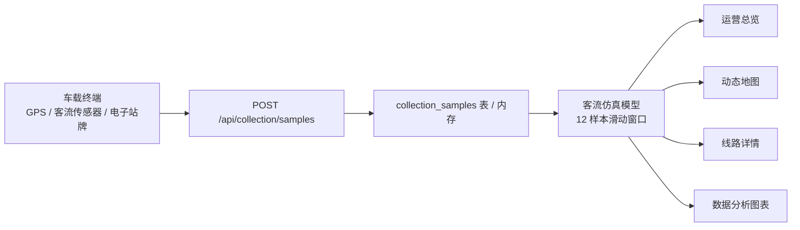

# 功能说明

> 版本：V3.2 &nbsp;&nbsp;|&nbsp;&nbsp;日期：2026-05-26

## 目录

- [1. 动态网页架构](#1-动态网页架构)
- [2. 数据采集过程](#2-数据采集过程)
- [3. 数据添加与可视化联动](#3-数据添加与可视化联动)
- [4. 高德真实地图 + Driving 路径规划](#4-高德真实地图--driving-路径规划)
- [5. 全线路箭头同步运行](#5-全线路箭头同步运行)
- [6. ECharts 平滑过渡渲染](#6-echarts-平滑过渡渲染)
- [7. 景点真实图片](#7-景点真实图片)
- [8. 核心亮点对比](#8-核心亮点对比)
- [9. 迭代功能演进](#9-迭代功能演进)
- [10. 开源借鉴说明](#10-开源借鉴说明)
- [11. 评分逻辑总结](#11-评分逻辑总结)

---

## 1. 动态网页架构

本系统是一个**全动态、数据驱动的智慧公交可视化平台**，包含以下核心模块：

| 模块 | 功能描述 |
|------|----------|
| 动态地图 | 高德 3D 底图 + AMap.Driving 真实道路路径 + 10 线箭头同步运行 |
| 自动采集 | 全局仿真采集器（App 层），每 1.5s 批量生成车辆运行样本，切换页面不中断 |
| 实时图表 | ECharts 客流趋势、满载率、热度排行，setOption 增量更新无闪烁 |
| 全站联动 | 运营总览计数器动画、热门重排、详情指标、分析图表全部响应采集数据 |
| 数学模型 | 客流仿真模型引入毫秒级 tickJitter，同一秒内连续调用返回不同值 |
| 景点导览 | 独立手绘风格 Landing 页，12 景点卡片 + 一键跳转主平台 + URL 参数深链联动 |
| 趣味交互 | 首页公交路网图片默认静态展示，点击后进入 3x3 华容道小游戏，支持复原、继续和水波扩散动效 |

公交车沿真实道路路径运行。全局采集器在主应用层持续运行，每约 1.5 秒批量生成多条线路样本（含 speed、passengerCount、loadRate、source）。切换页面后采集继续，实现**跨页面持续性数据驱动**。

详见 [动态数据模型说明](./动态数据模型说明.md)。

---

## 2. 数据采集过程

数据采集页模拟智慧公交的完整上报链路：



点击"开始采集"后，`App.vue` 的 `toggleCollector()` 启动全局 `setInterval(1500ms)`：

```text
runCollectorBatch()
  ├─ 随机选取 ≤3 条线路
  ├─ 生成: speed=27±8, passengerCount=46±21, loadRate=passengerCount×1.48
  ├─ POST /api/collection/samples × N
  └─ refreshDynamicData() → 拉取 routes/overview/statistics
```

切换到其他页面后采集仍继续运行。

---

## 3. 数据添加与可视化联动

手动新增或自动采集样本后，系统触发以下全站联动：

| 可视化位置 | 联动效果 |
|------------|----------|
| 数据采集趋势图 | 最近 18 条样本的满载率(折线) + 人数(柱状) + 速度(折线) 实时刷新 |
| 采集指标面板 | 样本数/平均速度/满载率 变化时触发 CSS 脉冲动画 |
| 运营总览客流 | 数字以 cubic ease-out 曲线 500ms 平滑计数过渡 |
| 运营总览热门排行 | 排行动态重排 |
| 地图箭头 | 采集 speed 驱动箭头移动速率（speedFactor = speed/27） |
| 遥测面板 | 高亮线路实时速度/人数/满载率 |
| 数据分析图表 | 全部 4 个 ECharts 图表 setOption 增量平滑过渡 |

这体现了课程核心要求：**"数据可以添加，并驱动可视化变化"**。本系统将该要求升级为**"数据持续生成，全站实时联动，视觉平滑过渡"**。

---

## 4. 高德真实地图 + Driving 路径规划

配置高德 Web JS API Key 后，动态地图展示**真实道路、地名、建筑和周边 POI**。

**V2.0 核心升级**：线路不再使用站点间直线连接或手工折线，而是通过 AMap.Driving 获取真实驾车路径：

1. AMap 脚本加载时预载 `AMap.Driving` 插件（`&plugin=AMap.Driving`）
2. 对每条线路调用 `driving.search(origin, destination, { waypoints })`
   - origin = 线路首站坐标
   - destination = 线路末站坐标
   - waypoints = 中间各站作为途经点
3. 提取 `result.routes[0].steps[].path` 得到沿真实道路的完整路径坐标
4. 单条线路 API 失败 → 自动回退备用路径，不影响其他线路

配置指南详见 [高德真实地图配置](./高德真实地图配置.md)。

---

## 5. 全线路箭头同步运行

**V2.0 核心升级**：从单线路 3D 小公交车改为 10 线同步 + SVG 导航箭头：

| 特性 | 说明 |
|------|------|
| 可见线路 | 全部 10 条线路同时渲染 |
| 车辆标记 | SVG chevron 导航箭头（比 3D 公交车更贴路、方向更明确） |
| 独立进度 | 每条线路维护 `routeProgress[routeId]`，初始随机分布避免堆叠 |
| 速度联动 | 采集样本 speed 驱动箭头移动速率 |
| 方向旋转 | `marker.setAngle(bearing)` 沿道路方向实时旋转 |
| 高亮交互 | 点击线路 → 高亮（完整不透明度 + 32px 大箭头），其余淡化到 35% |

动画引擎：统一 140ms 帧率，遍历所有线路更新 `setPosition` + `setAngle`。

---

## 6. ECharts 平滑过渡渲染

数据分析页和采集趋势图不再使用 `chart.dispose()` + `echarts.init()` 销毁重建模式：

```typescript
// 初始化：仅首次
if (!chart) chart = echarts.init(el);

// 更新：增量合并 + 动画过渡
chart.setOption(option, { notMerge: false });
// animationDuration: 400-600ms
// animationEasing: 'cubicOut'
```

对比效果：

| 维度 | dispose + init（旧） | setOption 增量（新） |
|------|---------------------|---------------------|
| 视觉 | 图表闪烁消失再出现 | 柱子/折线平滑过渡 |
| 性能 | 销毁 DOM + 重新创建 Canvas | 复用实例，仅更新数据 |
| 动画 | 无 | cubicOut 缓动曲线 |
| 用户体验 | 跳变，像页面刷新 | 流畅，像实时仪表盘 |

---

## 7. 景点真实图片

真实图片存放于 `frontend/public/spot-real-images`。

前端渲染逻辑：优先读取本地真实图片 → 加载失败时自动降级为 `/spot-images/` SVG 占位图 → 保证展示不出现空白。

---

## 8. 核心亮点对比

| 维度 | 普通实现（课程常见做法） | 本系统实现 |
|------|--------------------------|------------|
| **地图** | Leaflet 静态瓦片 / 无地图 | 高德 JS API 2.0 真实底图 |
| **路线** | 站点间直线连接 | AMap.Driving 获取真实道路路径，沿路弯曲 |
| **车辆** | 静态圆点或小图标 | SVG chevron 导航箭头，setAngle 实时转向 |
| **线路展示** | 单条线路切换 | 10 条线路全显示，高亮/淡化交互 |
| **数据更新** | 手动点击一次生成一条 | 采集器 1500ms 持续运行，全站自动刷新 |
| **可视化** | 静态图表 | 计数器动画 + ECharts setOption 平滑过渡 + 面板脉冲 |
| **数学模型** | 固定参数 | 秒级 tickJitter + 采集因子 + 趋势快照，每次调用值不同 |
| **地图降级** | 无 Key 则报错 | 自动降级内置 SVG 地图 + 备用路径 |
| **跨页面采集** | 切换页面采集停止 | App 层全局运行，切换页面不中断 |
| **导出能力** | 无 | CSV 导出采集样本，趋势 API 支持 30min 窗口查询 |
| **入口多样性** | 单入口 SPA | Landing 页景点导览 + SPA 主平台双入口，URL 参数深链联动 |
| **主题系统** | 单主题 | 暗色/白天双主题 + 日月图标一键切换 + ECharts 联动 |

---

## 9. 迭代功能演进

### V3.2（2026-05-26）— 数据库模式修复与首页趣味交互

- **首页插图升级**：运营总览右侧替换为生成式公交路线可视化图片，更贴合“昆明旅游公交决策”主题。
- **隐藏式华容道小游戏**：图片默认静态展示，点击后进入 3x3 拼图；右上角小图标提供复原和继续游戏，保持主界面美观。
- **水波扩散动效**：进入游戏、移动拼图和复原图片时触发轻量水波动画，作为不干扰业务功能的彩蛋交互。
- **真实数据模式显示**：状态栏改为调用 `/api/health` 获取真实 `dataMode`，避免界面显示与后端实际模式不一致。
- **MySQL 后台能力补齐**：MySQLRepository 支持 `/api/admin/recalculate-heat`，景点热度刷新可持久化。
- **Navicat 演示链路修复**：后台新增线路在 MySQL 模式下写入 `bus_routes`，可在 Navicat 刷新表后查看。

### V1.0（2026-05-09）— 基础架构搭建

- Vue 3 + Vite + TypeScript 前端脚手架
- Express REST API 后端框架
- MySQL 8 数据库设计（7 张核心表）
- 运营总览、动态地图、线路详情、数据分析、后台管理 5 大模块
- File/MySQL 双数据模式
- 基础 ECharts 图表渲染

### V2.0（2026-05-10）— 核心能力突破

- **AMap.Driving 真实道路路径规划**：前端调用高德驾车路线规划 API，线路沿真实路网绘制
- **全线路箭头同步运行**：10 条线路 SVG chevron 箭头以 140ms 帧率独立移动
- **秒级动态客流仿真**：引入 tickJitter 毫秒级种子 + minuteSeed 分钟级稳定因子
- **ECharts 平滑过渡渲染**：setOption 增量更新替代销毁重建
- **数据采集驱动全站可视化联动**：采集 → 模型 → 运营总览动画 → ECharts 过渡 → 地图变速
- **实时遥测面板**：地图高亮线路显示速度/人数/满载率

### V2.1（2026-05-10）— 交互体验增强

- **热度公式优化**：passengerFlow/1800 消除全 99 问题
- **景点热度手动刷新**：POST /api/admin/recalculate-heat，用户控制刷新时机
- **3 视角切换**：自由视角 / 跟随车辆（zoom=14） / 车内视角（zoom=17+旋转匹配朝向）
- **速率滑动条**：0.25x ~ 3x，箭头动画速度实时调节
- **站点点击弹窗**：InfoWindow 显示站点详情，3 秒自动消失
- **跟随气泡**：高亮线路箭头头顶显示「当前站→下一站」+ 客流模拟波动
- **Toast 通知系统**：右下角弹出式通知栈，采集批次完成/启停/异常实时反馈
- **全局状态栏**：采集引擎状态指示灯 + 样本计数 + 在线线路数 + 最近刷新时间
- **骨架屏加载**：首屏 shimmer 渐变骨架卡片 + 图表占位区
- **数据管道动效**：5 节点流程图，节点高亮 + 箭头光点流动
- **运营总览 UI 翻新**：Dashboard 更名为运营总览，图标/进度条/公式标签全面升级
- **Admin 布局重构**：左表单 + 右表格

### V2.2（2026-05-11）— 主题系统与数据深化

- **暗色/白天双主题系统**：CSS 变量 + data-theme 属性 + 日月图标切换
- **数据图表 Tab**：ChartPanel.vue，4 个 ECharts 图表 2x2 网格布局
- **MutationObserver 主题监听**：ECharts 图表自动重绘，轴标签/图例/tooltip 同步切换
- **双套字体颜色**：html[data-theme] 精确限定，暗色亮白/白天深黑
- **右侧面板气泡同步**：currentStopName/nextStopName 实时同步
- **94 路径修正**：沿湖滨路绕行滇池北岸
- **AMap 容器初始化时序修复**：interpolatePath 返回类型 + DOM 就绪检测

### V3.0（2026-05-13）— 生态完善与交付优化

- **景点导览 Landing 页**：独立手绘风格（Hand-drawn）HTML 页面，12 个昆明景点卡片展示，含真实图片、评分、分类标签和公交线路入口按钮。每个景点卡片点击可跳转主平台并自动筛选该景点相关线路（`?spot=` URL 参数深链联动）。侧边栏新增"景点导览页"入口链接。
- **CSV 数据导出**：GET /api/collection/samples/export，支持将全部采集样本导出为 CSV 文件（含 BOM 适配中文 Excel），便于答辩现场演示数据流转和后期数据分析。
- **趋势快照 API**：GET /api/statistics/trend?minutes=30，返回最近 N 分钟的客流量快照序列 + TOP 线路排行，支持趋势图按时间窗口回溯。
- **站点详情 API**：GET /api/stops/:id，按站点 ID 查询单个站点详细信息。
- **实时时钟**：顶部状态栏新增实时数字时钟（每秒刷新），模拟智慧城市监控大屏的时间显示。
- **样本计数器**：全局状态栏接入 /api/collection/summary 实时显示采集样本总数，独立于页面轮询。
- **全局状态栏数据模式指示**：状态栏新增当前数据模式（File/MySQL）显示。
- **文档体系全面升级**：12 份技术文档统一更新至 V3.0，修订记录完整覆盖 V1.0 → V3.0 全迭代过程。

### V3.1（2026-05-16）— 数学模型重构与视觉设计升级

- **客流仿真模型全面重构（Gravity Model v2）**：将 V3.0 的简单乘法启发式模型替换为基于学术文献的改进重力模型。核心公式改为站点 OD 对求和：`Flow = Σᵢⱼ (M_i × M_j × d^(-γ)) × scale × typeFactor × seasonality × holiday × spatialCompetition`。模型学术依据：Zhao et al. (2024, *Sustainability*) 重力模型 + Yang et al. (2023, *JTR*) 距离衰减 + Rong et al. (2023) 介入机会理论 + Zhou et al. (2025) & Ren et al. (2025, *TRR*) 节假日客流预测。详见[动态数据模型说明](./动态数据模型说明.md)。
- **24h 客流趋势图修正**：将原来的正弦波曲线替换为与仿真模型一致的逐小时因子数据。凌晨 0-5 点和 22 点后客流归零（公交停运），呈现真实的"早高峰→午间低谷→晚高峰→夜间归零"双峰形态。
- **暗色界面 Linear/Modern 设计系统**：整体暗色 UI 重构为近黑基底（`#050506`）+ 靛蓝强调色（`#5E6AD2`）的 Linear/Modern 风格。新增 4 层环境光背景系统（径向渐变 + SVG 噪点纹理 + 64px 网格 + 4 个动态渐变光晕）、多层阴影系统（边框高光 + 柔性散射 + 环境深度）、Expo-out 动画曲线。卡片圆角统一升级至 16px，字体栈升级至 Inter/Geist Sans。合并 `theme-fix.css` 入 `styles.css`。
- **ECharts 主题色同步**：全部图表配色从旧的 `#00d4ff`/`#2563eb` 靛蓝色系迁移至新的 `#5E6AD2`/`#6872D9` 强调色系。分析图表、数据图表面板、采集趋势图全部更新。
- **32 份文献支撑**：仿真模型参数全部由近年顶会/顶刊论文标定，包括距离衰减指数 γ、节假日客流放大系数、月度季节指数、空间竞争因子等。

---

## 10. 开源借鉴说明

项目参考 `ddiu8081/bus-vis` 的公交可视化产品思路，以及地图轨迹回放中 `Polyline + Moving Marker` 实现方式。代码、数据模型、后端接口、数据库和文档均围绕**昆明公交旅游主题**独立实现。

详见 [开源项目借鉴说明](./开源项目借鉴说明.md)。

---

## 11. 评分逻辑总结

本系统在课程基础要求之上，通过以下功能构成核心加分项：

1. **AMap.Driving 真实道路路径** — 区别于简单直线连线，公交车辆沿真实道路行驶
2. **全线路箭头同步运行** — 10 条线路各带 SVG 导航箭头独立移动，支持高亮交互
3. **仿真模型秒级动态波动** — tickJitter 毫秒级种子 + 采集因子 + 趋势快照，保证数据持续变化
4. **全站可视化联动** — 采集 → 模型 → 运营总览动画 → ECharts 平滑过渡 → 地图箭头变速
5. **ECharts setOption 增量更新** — 图表无闪烁，cubicOut 动画流畅过渡
6. **高德 3D 真实底图** — 真实道路、地名、POI、建筑，沉浸式地图体验
7. **景点真实图片 + 降级兜底** — 本地实拍优先，缺失自动回退占位图
8. **自动降级机制** — 无高德 Key 时自动使用内置 SVG 地图，保障展示稳定性
9. **暗色/白天双主题** — CSS 变量 + data-theme 属性 + ECharts MutationObserver 自动重绘
10. **景点导览 Landing 页** — 手绘风格独立入口 + URL 深链联动主平台
11. **CSV 数据导出** — 采集样本一键导出，支持中文 Excel 打开
12. **趋势快照 API** — 30 分钟回溯窗口客流趋势查询
13. **3 视角切换 + 速率控制** — 自由/跟随/车内视角 + 0.25x~3x 速率滑动条
14. **Toast 通知 + 全局状态栏 + 骨架屏** — 企业级 UI 交互体验

上述功能构成一个**完整的、持续运行的、以真实数据驱动可视化的智慧公交系统**，在技术深度、用户体验和工程完整性上均显著超出课程基本要求。
