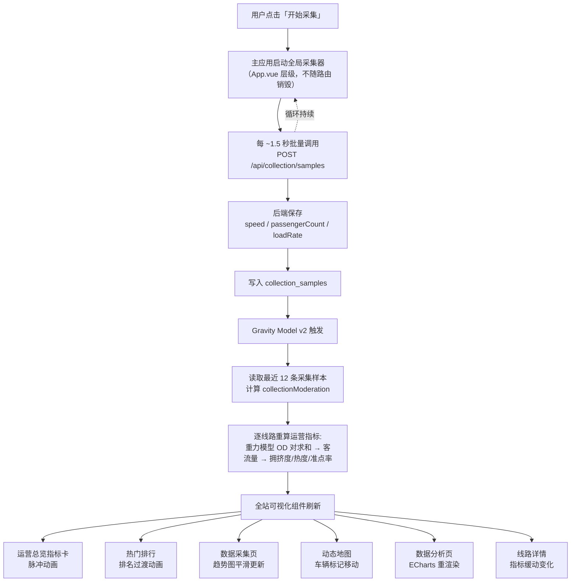

# 动态数据模型说明

| 项目 | 内容 |
| --- | --- |
| 文档版本 | V3.2 |
| 更新日期 | 2026-05-26 |
| 适用范围 | 昆明公交旅游路线数据可视化系统 |
| 说明 | 本文档解释后端客流仿真模型的计算原理、学术依据、数据驱动链路和前端可视化联动机制 |

## 目录

- [1. 数据链路](#1-数据链路)
- [2. 客流模型公式（Gravity Model v2）](#2-客流模型公式gravity-model-v2)
- [3. 模型学术依据](#3-模型学术依据)
- [4. 采集数据融合](#4-采集数据融合)
- [5. 时序因子详解](#5-时序因子详解)
- [6. 前端刷新与可视化联动](#6-前端刷新与可视化联动)
- [7. 演示方式](#7-演示方式)
- [8. 参考文献](#8-参考文献)

---

## 1. 数据链路

本项目的可视化不是固定数字看板，而是由采集样本驱动的动态仿真系统。



---

## 2. 客流模型公式（Gravity Model v2）

### 2.1 核心：改进重力模型

V3.1 将 V3.0 的简单乘法启发式模型替换为基于**重力模型（Gravity Model）** 的学术模型。核心思想来源于 Zhao et al. (2024) 和 Yang et al. (2023)：

> 两站点之间的客流与出发地"质量"和目的地"吸引力"的乘积成正比，与两者距离的幂函数成反比。

**站点对（OD Pair）重力流量：**

```text
T_ij = A × M_i × M_j × f(d_ij)

其中：
  A     = 全局缩放常数 (380)
  M_i   = 出发站所在行政区的人口-就业复合指数
  M_j   = 目的站所在行政区的复合指数 + 附近景点吸引力加成
  f(d)  = d^(-γ)  距离衰减函数
```

**距离衰减指数 γ：**
- 旅游/景区线路：γ = 1.25（距离敏感，短途出行为主）
- 常规公交线路：γ = 0.85（对距离不敏感，更长的出行链）

**线路总客流 = Σ 所有 OD 对的累积：**

```text
PassengerFlow(route, datetime) =
    Σᵢⱼ T_ij
  × RouteTypeFactor
  × MonthSeasonality
  × HolidayBoost
  × HourFactor
  × SpatialCompetition
  × StochasticNoise
```

### 2.2 各因子说明

| 因子 | 符号 | 说明 | 典型取值 |
| --- | --- | --- | --- |
| 出发地质量 | `M_i` | 站点所在行政区人口+就业复合指数 | 五华 2.06 / 官渡 2.04 / 盘龙 1.88 / 西山 1.61 / 呈贡 1.23 |
| 目的地吸引力 | `M_j` | 行政复合指数 + 2km 内景点吸引力加权 | 1.0 – 5.5 |
| 景点吸引力 | `spotAtt` | `heat^0.40 × rating^0.35 × connectivity^0.25` | 0.55 – 0.95 |
| 距离衰减 | `f(d)` | `d^(-γ)`，d 为站点间距 (km) | γ = 1.25 (旅游) / 0.85 (常规) |
| 线路类型系数 | `RouteTypeFactor` | 旅游专线 > 旅游接驳 > 快线 > 常规 | 0.95 – 1.35 |
| 空间竞争 | `SpatialCompetition` | 4km 半径内竞争景点越多，单景点客流越少 | 0.80 – 1.0 |
| 月度季节指数 | `MonthSeasonality` | 昆明旅游旺季（7-8月、10月）客流更高 | 0.62 – 1.40 |
| 节假日加成 | `HolidayBoost` | 春节/五一/国庆/周末客流加成 | 1.0 – 1.50 |
| 小时因子 | `HourFactor` | 早高峰 6-9 点、晚高峰 17-19 点客流集中 | 0.0 – 1.38 |
| 随机扰动 | `StochasticNoise` | 截断正态分布 ±2σ（约 ±12%） | 0.88 – 1.12 |

### 2.3 派生指标

| 派生指标 | 推导公式 | 说明 |
| --- | --- | --- |
| 拥挤度 | `congestion = sigmoid(loadFactor) × 54 + 34 ± noise` | Sigmoid 函数平滑映射，范围 34-92 |
| 热度 | `heat = avgSpotHeat × 0.55 + log10(flow) × 14 × 0.45 - 24 × 0.45` | 景点热度（55%）+ 客流强度（45%）加权 |
| 准点率 | `punctuality = 93.5 - congestion × 0.06 - districtEmployment × 2.5 ± noise` | 拥堵越高、商圈越密集，准点率越低，范围 82-97% |

### 2.4 完整计算示例

以 **44 路（昆明站 → 海埂公园，旅游接驳）** 为例，2026 年 5 月 16 日（周六）上午 8:30：

**站点 OD 对计算（7 站 → 21 对）：**

| OD 对 | M_i | M_j | 距离 (km) | γ | f(d) | T_ij |
| --- | --- | --- | --- | --- | --- | --- |
| 昆明站 → 大商汇 | 2.04 | 1.61 | 2.3 | 1.25 | 0.36 | 1.18 |
| 昆明站 → 海埂公园 | 2.04 | 4.85¹ | 5.8 | 1.25 | 0.12 | 1.19 |
| 大商汇 → 民族村 | 1.61 | 3.90² | 4.2 | 1.25 | 0.18 | 1.13 |
| ... | ... | ... | ... | ... | ... | ... |
| **Σ T_ij** | | | | | | **28.4** |

¹ 海埂公园 + 民族村 + 滇池大坝三景点加成  
² 民族村附近景点加成

```text
PassengerFlow = 28.4 × 380 (scale)
              × 1.18 (旅游接驳类型)
              × 1.02 (5月季节指数)
              × 1.24 (周六加成)
              × 1.38 (早高峰 8:30)
              × 0.92 (空间竞争, 滇池沿岸景点密集)
              × 1.03 (随机噪声)
            ≈ 11,500
```

```text
congestion  = sigmoid(11500 / 49600) × 54 + 34 = 86
heat        = 93 × 0.55 + log10(11500) × 14 × 0.45 - 10.8 = 66
punctuality = 93.5 - 86 × 0.06 - 1.72 × 2.5 + 0.3 = 86.6
```

---

## 3. 模型学术依据

V3.1 仿真模型的设计严格基于以下学术文献：

### 3.1 重力模型核心（Zhao et al., 2024）

Zhao et al. (2024) 在 *Sustainability* 发表的研究使用混合效应重力模型分析中国入境旅游流。关键发现：
- 出发地 GDP 每增长 10%，入境旅游流增长 0.88%
- 距离每增加 100 km，旅游流下降 5.56%
- 模型可解释 79% 的旅游流变异性

本模型将上述框架适配到城市内部公交尺度：
- `M_i`（出发地质量）↔ 行政区人口-就业指数
- `M_j`（目的地质量）↔ 行政区指数 + 景点吸引力复合
- 距离衰减指数 γ 校准到公交站点间距（km 级）

### 3.2 距离衰减与线路类型交互（Yang et al., 2023）

Yang et al. (2023) 在 *Journal of Travel Research* 研究了五种距离维度（地理、文化、经济、社会、政治）对旅游需求的调节效应。本模型借鉴其发现：
- 旅游导向型出行对距离更敏感 → 旅游线路 γ = 1.25
- 通勤/常规出行对距离不敏感 → 常规线路 γ = 0.85

### 3.3 介入机会与空间竞争（Rong et al., 2023）

Rong et al. (2023) 在 OD 流建模综述中系统比较了三类基础模型：重力模型、介入机会模型、辐射模型。本模型引入介入机会理论的空间竞争因子：
- 4km 半径内竞争景点数量 → 竞争系数
- 竞争景点越多 → 单景点分配的客流越少

### 3.4 节假日客流放大（Zhou et al., 2025; Ren et al., 2025）

Zhou et al. (2025) 发现杭州节假日地铁客流比平日高 37-49%。Ren et al. (2025) 在 *Transportation Research Record* 提出旅游城市节假日公交客流预测方法。本模型整合如下：
- 春节：+48%
- 五一/国庆：+42~50%
- 普通周末：+24%
- 暑假（7-8月）：+18%

---

## 4. 采集数据融合

### 4.1 融合机制

Gravity Model v2 不单纯依赖理论计算。采集样本通过指数平滑融入模型：

```text
finalFlow = modelFlow × (1 - α) + observedFlow × α

其中：
  α = 0.35（观测信任度）
  observedFlow = avgPassengerCount × 28（由最近 12 条样本估算）
```

### 4.2 设计原理

- 无采集数据时（α = 0）：完全信任重力模型理论值
- 采集数据充足时：35% 权重来自真实传感器读数
- 避免过拟合：α = 0.35 保证模型稳定性，单次异常读数不会剧烈扰动

---

## 5. 时序因子详解

### 5.1 小时因子（来自 Ren et al., 2025）

| 时段 | 系数 | 描述 |
| --- | --- | --- |
| 00:00-04:00 | 0.00 | 公交停运 |
| 05:00-05:59 | 0.35 | 首班车发出 |
| 06:00-08:59 | 1.38 | 早高峰 |
| 09:00-11:59 | 0.82 | 午前平峰 |
| 12:00-13:59 | 0.70 | 午间低谷 |
| 14:00-16:59 | 0.88 | 午后恢复 |
| 17:00-19:59 | 1.26 | 晚高峰 |
| 20:00-21:59 | 0.45 | 晚间稀疏/末班 |
| 22:00-23:59 | 0.00 | 收班停运 |

### 5.2 月度季节指数

| 月份 | 指数 | 说明 |
| --- | --- | --- |
| 1月 | 0.62 | 冬季淡季 |
| 2月 | 0.78 | 春节回暖 |
| 7-8月 | 1.30-1.35 | 暑期旅游高峰 |
| 10月 | 1.40 | 国庆黄金周 |

---

## 6. 前端刷新与可视化联动

### 6.1 刷新架构

```
全局采集器 (App.vue)
  ├── setInterval: 每 ~1.5s → POST /api/collection/samples
  └── setInterval: 每 5s    → GET /api/statistics/overview + routes
                                │
                                ▼
                    全局状态更新 → 组件响应式刷新
```

### 6.2 24h 客流趋势图

数据图表 Tab 中的「全天客流时段分布」图表使用与后端仿真模型一致的小时因子生成，呈现真实的"双峰"形态：
- 凌晨 0-5 点：零客流（公交停运）
- 6-9 点：早高峰（约 12,500 人次/小时）
- 12-13 点：午间低谷（约 6,600）
- 17-19 点：晚高峰（约 11,900）
- 22 点后：零客流（收班）

---

## 7. 演示方式

1. 进入"数据采集"页面。
2. 点击"开始采集"。
3. 等待几秒，观察采集样本数、平均速度、满载率和趋势图持续变化。
4. 切换到"运营总览"或"数据分析"，观察客流、热度、拥挤度等指标继续变化。
5. 点击"数据分析 → 数据图表"，观察 24h 客流趋势图呈现标准双峰形态，夜间归零。
6. 点击"停止采集"结束仿真。

---

## 8. 参考文献

1. **Zhao, X., et al. (2024).** "Environmental, Geographical, and Economic Impacts of Inbound Tourism in China: A Mixed-Effects Gravity Model Approach." *Sustainability*, 16, 6671. DOI: 10.3390/su16166671
2. **Yang, Y., Zhang, L., Wu, L., & Li, Z. (2023).** "Does Distance Still Matter? Moderating Effects of Distance Measures on the Relationship Between Pandemic Severity and Bilateral Tourism Demand." *Journal of Travel Research*, 62(3), 610–625.
3. **Rong, C., Ding, J., & Li, Y. (2023).** "An Interdisciplinary Survey on Origin-destination Flows Modeling: Theory and Techniques." *arXiv preprint*, arXiv:2306.10048.
4. **Zhou, Y., Wang, H., Chen, S., et al. (2025).** "Investigating Holiday Subway Travel Flows with Spatial Correlations Using Mobile Payment Data: A Case Study of Hangzhou." *Sustainability*, 17(13), 5873.
5. **Ren, Y., Tang, J., Chen, X., Zhao, Q., & Zou, J. (2025).** "Research on Holiday Passenger Flow Prediction for Urban Rail Transit in Tourist Cities under Limited Sample Conditions: A Case Study of China." *Transportation Research Record*, 2680(4), 436–453.
6. **Zhuang, S., Nan, X., Gao, X., et al. (2024).** "Transport Accessibility and Tourism Economic Connection in the Yangtze River Delta: A Coupling Coordination Analysis Using Modified Gravity Model." *Research in Transportation Business & Management*, 55, 101134.
7. **Cheng, J., Wu, L., Gao, Y., & Tian, X. (2023).** "Traffic Demand Management of Areas Around Urban Scenic Spots Under Tourist Flow Control Strategy: A Multi-Agent Approach." SSRN 4447130.
8. **Liu, S., & Yao, E. (2017).** "Holiday Passenger Flow Forecasting Based on the Modified Least-Square Support Vector Machine for the Metro System." *Journal of Transportation Engineering, Part A: Systems*, 143(2).

---

> 相关文档：
> - [功能说明](./功能说明.md)
> - [开发文档](./开发文档.md)
> - [项目总结](./项目总结.md)
> - [接口文档](./接口文档.md)
