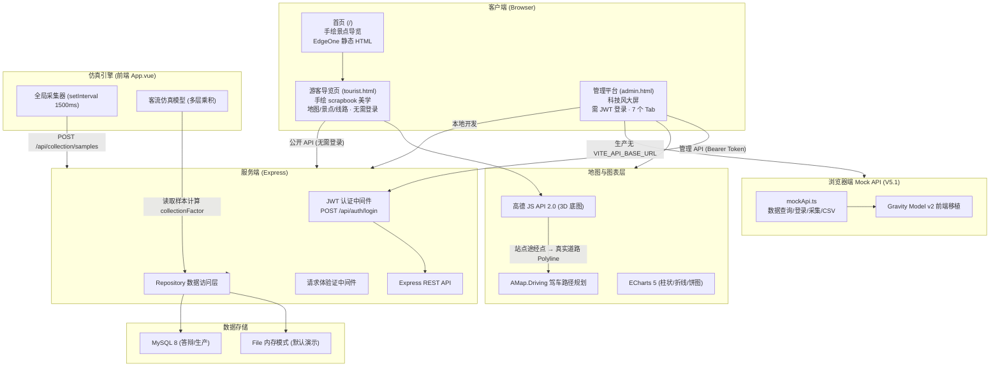
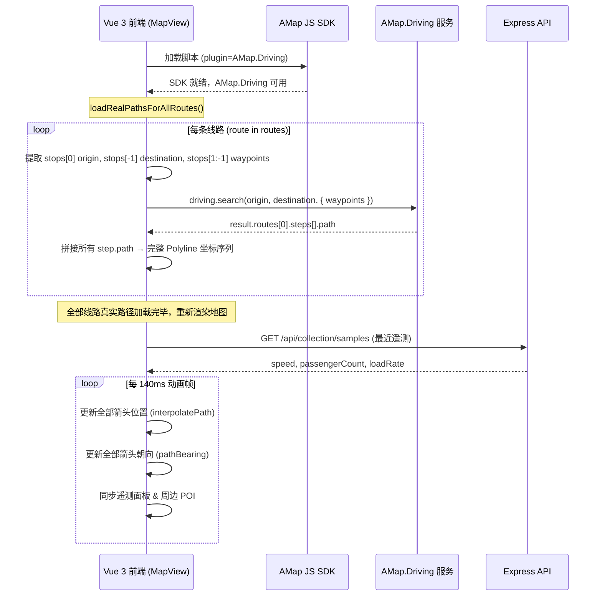

# 昆明公交旅游路线数据可视化平台 -- 开发文档

| 属性 | 内容 |
| --- | --- |
| 文档编号 | KM-BUS-DEV-003 |
| 文档版本 | V5.1 |
| 上一版本 | V5.0 (2026-05-26) |
| 制定日期 | 2026-06-09 |
| 项目类型 | 实训全栈 Web 项目 |
| 技术栈 | Vue 3 (Composition API) / TypeScript / Vite / ECharts 5 / Express.js / MySQL 8 / AMap JS API 2.0 |
| 数据模式 | 本地 Express/File 演示模式 / 浏览器端 Mock API 生产模式 / MySQL 可选持久化模式 |
| 交付物 | EdgeOne Pages 静态站点、前端管理端与游客端、REST API 本地服务、数据库 DDL/DML、接口文档、测试报告、成果 PPT |

## 目录

- [1. 修订记录](#1-修订记录)
- [2. 项目概述](#2-项目概述)
- [3. 建设目标](#3-建设目标)
- [4. 系统范围](#4-系统范围)
- [5. 总体架构](#5-总体架构)
- [6. 模块设计](#6-模块设计)
- [7. 核心技术决策](#7-核心技术决策)
- [8. 数据采集与可视化联动链路](#8-数据采集与可视化联动链路)
- [9. 接口规范](#9-接口规范)
- [10. 数据库设计](#10-数据库设计)
- [11. 文件结构](#11-文件结构)
- [12. 技术亮点](#12-技术亮点)
- [13. 环境启动](#13-环境启动)
- [14. 验收标准](#14-验收标准)
- [15. 交付清单](#15-交付清单)

---

## 1. 修订记录

| 版本 | 日期 | 修订内容 | 修订人 |
| --- | --- | --- | --- |
| V1.0 | 2026-05-09 | 初始版本，覆盖基础架构、模块设计与交付清单 | 项目组 |
| V2.0 | 2026-05-10 | 增加高德 Driving 路线规划集成、全线路同步运行引擎、动态仿真秒级抖动、ECharts 平滑过渡渲染、实时遥测面板、数据采集驱动全站可视化联动指标体系；新增技术亮点章节与文件结构说明 | 项目组 |
| V2.1 | 2026-05-10 | 热度公式优化（passengerFlow/1800）消除全99问题；景点热度改为手动触发刷新（POST /api/admin/recalculate-heat）；MapView 新增跟随/车内视角切换、速率滑动条、站点点击弹窗、下一站+客流模拟跟随气泡；Dashboard 重命名为运营总览并全 UI 翻新（图标/进度条/公式标签）；Admin 布局重构（左表单+右表格）；新增 Toast 通知系统、全局状态栏、骨架屏加载、数据管道动效 | 项目组 |
| V2.2 | 2026-05-11 | 暗色/白天双主题系统（CSS 变量 + data-theme 属性 + 日月图标切换）；新增「数据图表」Tab（ChartPanel.vue，4 个 ECharts 图表：客流柱状图、时段折线图、站点排行横向柱状图、线路类型占比饼图，MutationObserver 监听主题变化自动重绘）；全局双套字体颜色（html[data-theme] 精确限定，暗色亮白/白天深黑）；右侧面板同步气泡站点信息（currentStopName/nextStopName）；94路路径修正（沿湖滨路绕行滇池北岸）；interpolatePath 返回类型修复；AMap 容器初始化时序修复 | 项目组 |
| V3.0 | 2026-05-13 | 新增景点导览 Landing 页（手绘风格 HTML，12 景点卡片 + 真实图片 + URL 参数 ?spot= 深链联动主平台地图筛选）；新增 CSV 数据导出接口；新增趋势快照 API；新增站点详情接口；顶部状态栏新增实时数字时钟；全局状态栏接入采集样本总数实时显示 + 数据模式指示；全部 12 份技术文档统一升级至 V3.0 | 项目组 |
| V3.1 | 2026-05-16 | 客流仿真模型全面重构为 Gravity Model v2（基于 Zhao et al. 2024 / Yang et al. 2023 / Rong et al. 2023 / Zhou et al. 2025 / Ren et al. 2025 五篇顶会/顶刊论文）；24h 客流趋势图修正为真实逐小时双峰分布（夜间归零）；暗色界面升级为 Linear/Modern 设计系统（4 层环境光背景 + 动态光晕 + 多层阴影 + Expo-out 动画）；ECharts 图表配色全面同步新主题；合并 theme-fix.css 入 styles.css；32 份文献标定模型参数 | 项目组 |
| V3.2 | 2026-05-26 | 首页运营总览插图升级为生成式公交路网可视化图片；新增隐藏式 3x3 华容道小游戏交互（点击图片进入、复原按钮、继续按钮、水波动效）；状态栏数据模式改为读取 `/api/health` 真实 `dataMode`；MySQLRepository 补齐景点热度刷新接口；修复 MySQL 模式后台新增线路与 Navicat 数据查看链路 | 项目组 |
| V4.0 | 2026-05-26 | 新增游客导览视图（`tourist.html`），采用与景点导览页一致的手绘 scrapbook 美学（Kalam + Patrick Hand 手写字体、graph-paper 点阵背景、wobbly 不规则边框、tape/tack 装饰）；新建 `frontend/src/tourist/` 目录（TouristApp/TouristMap/TouristSpots/TouristRoutes/TouristDetail + API + 样式 + 攻略数据）；Vite 多页面构建，游客页面独立打包不加载 ECharts/Element Plus；游客端仅展示地图/景点/线路三大模块，隐藏图表、数据表格、KPI 面板、采集控件等管理功能；Landing 页链接全部指向游客导览页，形成完整游客浏览路径 | 项目组 |
| V5.0 | 2026-05-26 | 新增 JWT 管理员登录认证（`authMiddleware.js`），默认账号 admin/admin123；后端新增 `POST /api/auth/login` 和 `GET /api/auth/verify` 认证接口；管理员 API（线路 CRUD、景点热度刷新）需 Bearer Token 鉴权；游客端 API 保持公开无需登录；前端新增 LoginView.vue 登录组件（暗色仪表盘风格）；App.vue 增加登录门控（`authenticated` 状态 + localStorage Token 持久化）；API 层新增 `setAuthToken`/`clearAuthToken` 及自动 Bearer 头注入；侧边栏新增退出登录按钮；后台标题改为"数据管理平台"；管理员与游客权限完全分离 | 项目组 |
| V5.1 | 2026-06-09 | 面向腾讯云 EdgeOne Pages 完成纯静态部署改造：新增浏览器端 `mockApi.ts`，在生产环境无 `VITE_API_BASE_URL` 时自动替代 Express 后端；首页改为手绘景点导览页，管理员入口隐藏至 `/admin.html`；`frontend/public/index.html` 用于 EdgeOne Pages 静态首页输出；文档与示例配置完成脱敏，线上部署不暴露默认账号密码和后端环境变量 | 项目组 |

---

## 2. 项目概述

本系统面向昆明市公交旅游出行场景，构建一个涵盖**游客导览、数据采集、地图可视化、运营分析、后台管理**的全栈 Web 应用。项目严格遵循前后端分离、RESTful API、关系型数据库建模的企业工程规范，核心目标为：

- 展示从"车载终端数据上报 --> API 入库 --> 仿真模型计算 --> 全站可视化联动"的完整数据链路
- 为游客提供手绘 scrapbook 美学风格的导览页面，可浏览地图/景点/线路，无需登录
- 为管理员提供科技风数据大屏，可监控客流、采集数据、分析图表、管理线路，需 JWT 登录
- 提供可交互的高德 3D 地图，所有公交线路沿真实道路路径渲染，车辆以导航箭头形式同步运行
- 通过秒级动态客流仿真模型，让数据持续变化并实时反映到运营总览、图表与分析面板
- 实现三大特性：高德真实道路路线集成 (`AMap.Driving`)、全线路同屏实时监控、数据采集驱动全站可视化联动
- 输出符合互联网公司交付标准的结构化技术文档

---

## 3. 建设目标

| 目标域 | 具体目标 |
| --- | --- |
| 数据管理 | 完成线路、站点、景点、运营指标和采集样本的结构化存储与查询 |
| 游客导览 | 独立游客端页面（手绘 scrapbook 美学），地图 + 景点 + 线路三大模块，无需登录 |
| 权限分离 | JWT 管理员登录认证，管理员 API 需 Bearer Token；游客端 API 公开 |
| 地图可视化 | 接入高德 JS API 2.0 + Driving 插件，10 条线路沿真实道路渲染，多箭头同步运行 |
| 真实道路集成 | 前端调用 `AMap.Driving.search()` 获取真实驾车路径，以站点序列为途经点生成贴合路网的 Polyline |
| 全线路同屏监控 | 10 条线路各维护独立 progress 与动画帧，全部 SVG chevron 箭头沿各自路线同步移动，速度受采集遥测驱动 |
| 实时采集 | 全局采集引擎持续生成车辆运行样本，支持自动仿真与人工补录双通道 |
| 可视化联动 | 采集数据入库后驱动运营总览指标脉冲动画、热门排行重算、地图遥测刷新、详情指标更新、分析图表过渡渲染 |
| 动态仿真 | 客流模型引入分钟/秒级扰动因子，每次查询产生可观测的数值变化 |
| 图表联动 | ECharts 图表以 `setOption` 增量更新替代销毁重建，实现平滑过渡动画 |
| 工程质量 | 输出需求分析、概要设计、接口文档、数据库设计、采集方案、测试报告六类交付文档 |

---

## 4. 系统范围

### 4.1 功能范围

| 模块 | 描述 |
| --- | --- |
| 游客导览 (V4.0) | 独立多页面入口（`/tourist.html`），手绘 scrapbook 美学；动态地图（路线动画 + 景点标注）、景点卡片网格（展开游玩攻略）、线路卡片列表；无需登录，不含图表面板和管理功能 |
| 运营总览 | 线路数/站点数/景点数/动态客流 (动画计数器)、热门线路排行 (实时刷新)、线路卡片 |
| 动态地图 | 高德 3D 底图 + `AMap.Driving` 真实道路路径、10 条线路同时渲染、导航箭头同步运动、高亮/淡化交互、周边 POI、景点详情卡片 |
| 高德真实道路路线集成 | 前端加载 `AMap.Driving` 插件，对每条线路以首站为 origin、末站为 destination、中间站点为 waypoints 调用驾车路径规划，解析 `steps[].path` 拼接为真实道路 Polyline；Driving API 不可用时自动回退至备用路径 |
| 全线路同屏实时监控 | 全部线路的 SVG chevron 箭头 Marker 以 140ms 帧率沿各自路线同步移动，位置通过 `interpolatePath` 沿 Polyline 线性插值，朝向通过 `pathBearing` 计算切线方向，速度受采集遥测中的 `speed` 字段实时驱动 |
| 线路详情 | 站点时间线、运营指标面板、关联景点列表 |
| 数据分析 | 客流柱状图、景点热度排行、区域分布饼图、拥挤度-准点率双线图 (全部 `setOption` 增量更新) |
| 数据采集 | 全局采集引擎 (1500ms/批)、手动补录表单、实时趋势图、遥测指标面板 (脉冲动画)、最近记录表 |
| 采集驱动全站联动 | 采集样本写入后：运营总览指标数值动画 + `pulse` 脉冲边框 + `value-flash` 闪烁、热门排行重算、地图遥测面板实时刷新、线路详情运营指标更新、数据分析 ECharts 图表过渡动画 |
| 后台管理 | 线路新增/删除、线路列表维护、景点热度手动刷新 |
| 权限认证 (V5.0) | JWT 管理员登录（`POST /api/auth/login`），管理员 API 需 Bearer Token 鉴权；游客端 API 公开无需登录 |
| API 服务 | Express REST API，统一 `{ data }` 响应格式，File/Mysql 双模式透明切换；状态栏通过 `/api/health` 展示真实数据模式 |

### 4.2 范围外

- 不接入真实公交公司生产系统
- 教学近似坐标不用于真实导航
- 教学近似坐标不用于真实导航

---

## 5. 总体架构

系统采用前后端分离架构，并在 V5.1 针对 EdgeOne Pages 增加纯静态部署模式。线上首页 `/` 为手绘景点导览页，管理员入口为 `/admin.html`；本地开发时管理端可调用 Express REST API，线上生产环境在未配置 `VITE_API_BASE_URL` 时自动切换至浏览器端 `mockApi.ts`，由前端内存数据和仿真引擎完成数据查询、登录验证、采集样本和 CSV 导出。Express 后端保留为本地开发、接口演示和 MySQL 扩展方案。



### 5.1 高德 Driving API 调用流程



---

## 6. 模块设计

### 6.1 模块功能总览

| 模块 | 主要功能 | 相关接口 |
| --- | --- | --- |
| 游客导览 (V4.0 新增) | 独立多页面（`/tourist.html`），手绘 scrapbook 美学风格；动态地图（路线动画 + 景点标注）、景点卡片网格（展开查看游玩攻略：怎么玩/体验什么/最佳时节）、线路卡片列表；使用 `touristApi` 仅调用公开接口，不加载 ECharts/Element Plus | `GET /api/routes`, `GET /api/spots`, `GET /api/statistics/overview` |
| 权限认证 (V5.0 新增) | JWT 登录（`POST /api/auth/login`），Token 24h 有效期；`authRequired` 中间件保护管理员 API；前端 `LoginView.vue` 登录组件 + `api.ts` 自动 Bearer 头注入 + `App.vue` 登录门控 + localStorage Token 持久化 | `POST /api/auth/login`, `GET /api/auth/verify` |
| 运营总览 | 线路/站点/景点数量展示、动态模型客流 (动画计数器)、热门线路 TOP 5 排行、采集运行时指标脉冲动画 | `GET /api/statistics/overview` |
| 地图可视化 | 高德 3D 底图渲染、全线路 Polyline、站点/景点 Marker、周边 POI 列表、景点详情卡片、内置 SVG 降级方案 | `GET /api/routes`, `GET /api/spots` |
| 高德真实道路路线集成 | 前端调用 `AMap.Driving` 驾车路径规划 API，以站点序列作为途经点，获取贴合昆明真实路网的 Polyline 路径，替代直线插值算法；Driving API 不可用时自动回退内置备用路径 | 前端直连高德 API |
| 全线路同屏实时监控 | 10 条线路各维护独立动画进度 (`routeProgress`)，全部 SVG chevron 箭头以 140ms 帧率同步移动，速度受采集遥测实时驱动；点击线路高亮可查看遥测面板 (速度/人数/满载率) 与周边 POI | `GET /api/collection/samples`, `GET /api/collection/summary` |
| 线路详情 | 站点时间线、运营指标面板 (运营时间/票价/类型)、关联景点列表、近邻线路入口 | `GET /api/routes/:id` |
| 数据分析 | 4 组 ECharts 图表：客流柱状图、景点热度排行、区域分布饼图、拥挤度-准点率双线图，全部 `setOption` 增量更新避免闪烁 | `GET /api/statistics/routes` |
| 数据采集 | 全局采集引擎 (1500ms/批)，手动补录表单，遥测指标面板 (采集样本数/在线设备/平均速度/平均满载率，含 pulse 动画)，实时趋势 ECharts 折线+柱状混合图，最近记录列表 | `GET/POST /api/collection/samples`, `GET /api/collection/summary` |
| 采集驱动全站可视化联动 | 采集样本写入后触发：运营总览指标 value-flash 闪烁 + pulse 脉冲边框 + 数值平滑动画、热门线路排行重算、地图遥测面板刷新、线路详情运营指标更新、数据分析 ECharts 图表过渡动画 | 跨模块事件驱动 |
| 后台管理 | 新增/删除线路，线路列表维护，景点热度手动刷新，表单验证 | `POST/PUT/DELETE /api/admin/routes`, `POST /api/admin/recalculate-heat` |

### 6.2 新功能模块详解

#### 6.2.1 高德真实道路路线集成 (`AMap.Driving`)

**背景**：早期版本线路轨迹由站点间直线连接构成，导致部分线路穿越滇池水面或建筑群，视觉保真度不足。

**实现**：前端 MapView 组件在加载高德地图脚本时同步注册 `AMap.Driving` 插件 (`plugin=AMap.Driving`)。在 `loadRealPathsForAllRoutes()` 方法中：

1. 遍历全部线路，提取 `route.stops` 数组。
2. 以 `stops[0]` 为起点、`stops[stops.length-1]` 为终点、中间站点为途经点 (`waypoints`)。
3. 创建 `AMap.Driving` 实例并调用 `search(origin, destination, { waypoints })`。
4. 在回调中解析 `result.routes[0].steps`，拼接每个 `step.path` 坐标数组形成完整 Polyline。
5. 路径缓存至 `realPaths` 响应式对象，按线路编号 (`route.number`) 索引。
6. 渲染时使用 `getDisplayPath()` 优先取真实路径，降级至内置备用路径或原始 polyline。

**容错**：若 Driving API 不可用 (无 Key、超时、网络错误)，`fetchDrivingPath` 返回 `null`，`getDisplayPath()` 自动回退至 `routePathOverrides` 中预置的 3 条重点线路手动修正路径，最终兜底至原始直线 polyline。

#### 6.2.2 全线路同屏实时监控

**背景**：传统轨迹回放通常仅展示单条线路的单辆公交车，无法体现"公交调度监控大屏"的全景视角。

**实现**：

- **状态管理**：MapView 组件维护 `routeProgress: Record<number, number>` (线路 ID -> 0-1 进度)、`routeTelemetry: Record<number, CollectionSample>` (线路 ID -> 最新遥测)。
- **动画循环**：`setInterval(140ms)` 每帧遍历全部线路，根据遥测速度 (`speed ?? 27`) 计算步长因子 (`factor = clamp(speed/27, 0.3, 2.5)`)，累加 progress 并取模 1。
- **位置计算**：`interpolatePath(points, progress)` 沿 Polyline 线性插值，返回当前帧箭头经纬度。
- **朝向计算**：`pathBearing(points, progress)` 计算路径切线方向 (atan2)，设置 Marker angle 属性。
- **渲染**：全部线路的 SVG chevron 箭头通过 `AMap.Marker` 渲染，高亮线路 zIndex 更高、箭头尺寸更大。
- **交互**：点击左侧线路列表高亮单条线路，该线路 Polyline 全不透明度、其余淡化至 0.35；遥测面板显示该线路速度/人数/满载率；POI 面板按箭头当前位置距离排序展示周边站点与景点。

#### 6.2.3 数据采集驱动全站可视化联动

**背景**：静态数据展示无法体现"数据驱动视图"的工程能力，需要证明数据采集与全站 UI 之间存在闭环联动。

**实现**（详细链路见 [第 8 章](#8-数据采集与可视化联动链路)）：

| 联动目标 | 视觉反馈 | 实现机制 |
| --- | --- | --- |
| 运营总览指标面板 | `metric-pulse` 脉冲边框 (采集运行时) + `value-changed` 数值闪烁 (值变化时) + `requestAnimationFrame` 数值平滑过渡 | CSS animation + setTimeout 清除 class + DashboardView watch |
| 热门线路排行 | 排行顺序与热度值实时更新 | `refreshDynamicData()` 拉取最新 overview |
| 地图遥测面板 | 速度/人数/满载率数字实时刷新，影响箭头移动速度 | 2500ms 轮询 `GET /api/collection/samples` |
| 线路详情指标 | 运营统计指标面板数值更新 | 轮询触发组件数据刷新 |
| 数据分析图表 | ECharts `setOption` 增量更新，`animationDuration: 400` 过渡 | CollectionView/AnalyticsView 数据变化触发 |
| 数据采集趋势图 | 满载率折线 + 人数柱状 + 速度折线实时追加数据点 | CollectionView 2000ms 自轮询 |

#### 6.2.4 游客导览视图 (V4.0)

**背景**：原有平台以"交通指挥中心大屏"为设计定位，所有页面（包括饼图、柱状图、数据表格、采集控件）对游客可见，与景点导览 Landing 页的手绘 scrapbook 美学风格割裂，不符合旅游场景的用户体验。

**实现**：

- **独立入口**：通过 Vite 多页面构建（`rollupOptions.input`），新增 `tourist.html` 入口，独立打包不加载 ECharts 和 Element Plus。
- **设计系统**：新建 `tourist-styles.css`，继承 `landing.html` 的全部视觉语言——手写字体（Kalam + Patrick Hand）、graph-paper 点阵背景、wobbly 不规则边框、offset 实心阴影、dashed 虚线边框、tape/tack 物理装饰、卡片交替旋转。
- **组件架构**：
  - `TouristApp.vue`：根布局组件，三大标签页（地图/景点/线路）+ scrapbook 风格顶栏底栏，处理 `?spot=` 深链联动。
  - `TouristMap.vue`：从 MapView.vue 提取游客核心功能（AMap 初始化、路线 Polyline、景点 Marker、箭头动画、站点弹窗、景点详情卡片），移除遥测面板、速度控制、视角切换、跟随气泡、POI 侧栏、SVG 降级地图。箭头动画使用固定基准速度（无需遥测轮询）。
  - `TouristSpots.vue`：12 个景点卡片网格，点击展开完整游玩攻略（怎么玩/体验什么/最佳时节），攻略数据来自 `spotGuides.ts` 静态查找表，路线提示来自 API 查询结果。
  - `TouristRoutes.vue`：10 条线路卡片，展示线路编号、名称、起终点、运营时间、票价、类型、途经站点标签。
  - `TouristDetail.vue`：景点/线路详情面板，景点展开完整攻略 + 可到达公交线路；线路展示途经站点列表 + 沿线景点。
- **API 隔离**：`tourist-api.ts` 仅封装公开接口（routes/spots/stops/overview/routeStatistics/createCollectionSample），不含任何管理接口。

#### 6.2.5 JWT 管理员登录认证 (V5.0)

**背景**：V3.x 版本中所有接口（包括线路增删改、景点热度刷新）均无需认证，不符合"管理员操作需要权限"的安全要求。

**实现**：

- **后端认证中间件**（`backend/src/authMiddleware.js`）：
  - `generateToken(payload)`：使用 `jsonwebtoken` 签发 Token，24h 过期，密钥来自环境变量 `JWT_SECRET`。
  - `authRequired(req, res, next)`：从 `Authorization: Bearer <token>` 提取并验证 Token，成功则设置 `req.user`，失败返回 401。
- **认证接口**（`server.js`）：
  - `POST /api/auth/login`：校验用户名密码（环境变量 `ADMIN_USER`/`ADMIN_PASS`），返回 JWT Token。
  - `GET /api/auth/verify`：验证 Token 有效性，用于前端页面刷新时恢复登录态。
- **路由保护**：`authRequired` 中间件应用于 `POST/PUT/DELETE /api/admin/routes` 和 `POST /api/admin/recalculate-heat`。所有 GET 接口和 `POST /api/collection/samples` 保持公开。
- **前端登录门控**（`App.vue`）：
  - `authenticated` 响应式状态控制管理外壳的显示/隐藏。
  - `onMounted` 时检查 `localStorage` 中的 Token，调用 `/api/auth/verify` 验证有效性，有效则自动登录，无效则清除 Token 并显示登录页。
  - `LoginView.vue`：暗色仪表盘风格的登录表单卡片，包含用户名/密码输入、显示/隐藏密码切换、登录状态提示和默认账号提示。
- **API 层 Token 注入**（`api.ts`）：
  - `setAuthToken(token)` / `clearAuthToken()` 管理模块级 Token 变量。
  - `send()` 函数自动在所有请求中注入 `Authorization: Bearer` 请求头。
  - 新增 `login()` 和 `verifyAuth()` 两个认证方法。
- **侧边栏**：新增退出登录按钮（红色，带登出图标），显示当前管理员用户名；Landing 链接指向 `/tourist.html` 游客导览页。

---

## 7. 核心技术决策

| 决策点 | 方案 | 依据 |
| --- | --- | --- |
| 地图引擎 | 高德 JS API 2.0 + Driving 插件 | 国内坐标精度高、3D 建筑数据完整、路径规划 REST API 可用 |
| 路线渲染 | `AMap.Driving.search()` 获取真实驾车路径 | 直线连接站点会穿湖穿楼，真实路径沿道路贴合度高 |
| 车辆标记 | SVG chevron 箭头 + `marker.setAngle()` | 比 3D CSS 公交车更贴路、旋转无锯齿、方向感明确 |
| 全线路模式 | 10 条线路各维护独立 progress，统一 140ms 动画帧 | 视觉效果接近真实车队监控大屏 |
| 图表更新 | `chart.setOption(opt, { notMerge: false })` | 销毁重建会引起闪烁，增量更新配合 `animationDuration` 平滑过渡 |
| 客流模型 | 秒级种子 + tickJitter | 同一分钟内多次调用产生不同值，验证"数据在变"的观感 |
| 数据模式 | File (默认演示) / MySQL (答辩数据库能力) | 同一套接口、两套 Repository，演示时无需 MySQL 环境 |
| 降级策略 | 高德 3D 地图 / 内置 SVG 地图双层降级 | 未配置 Key 或加载失败时仍可展示全部数据，确保答辩零宕机 |
| 联动架构 | 前端全局采集器 + 各页面独立轮询 | 采集器持续运行于 App.vue，页面切换不影响采集进程 |

---

## 8. 数据采集与可视化联动链路

```
用户点击「开始采集」
  --> App.vue 全局采集器启动 (setInterval 1500ms)
  --> 每批随机选取 ≤4 条线路，生成 speed / passengerCount / loadRate
  --> POST /api/collection/samples x N
  --> 后端 Repository 写入内存或 MySQL
  --> 客流仿真模型读取最近 12 条样本，计算 collectionFactor
  --> refreshDynamicData() 拉取 /api/routes + /api/statistics/*
  --> 运营总览计数器动画、热门排行重算
  --> 数据分析 ECharts 增量更新
  --> 地图动画循环读取 routeTelemetry[speed] 调整箭头速率
```

### 8.1 前端刷新策略

| 触发源 | 频率 | 影响范围 |
| --- | --- | --- |
| 全局采集器 | 1500ms | 创建样本 --> 后端写入 --> 全站数据刷新 |
| 动态数据轮询 | 5000ms | routes + overview + statistics |
| CollectionView 自轮询 | 2000ms | samples + summary + ECharts 趋势图 |
| 地图动画帧 | 140ms | 10 条线路箭头位置 + 角度更新 |
| 遥测轮询 | 2500ms | 各线路最新采集样本 |
| POI 轮询 | 8000ms | 高亮线路周边站点/景点 |

---

## 9. 接口规范

- Base URL：`http://localhost:3000`
- 成功响应：`{ "data": ... }`
- 错误响应：`{ "message": "错误描述" }`
- 查询：`GET`，新增：`POST`，修改：`PUT`，删除：`DELETE`
- 前端 camelCase <--> 数据库 snake_case 自动映射
- 采集接口 POST 请求体经 `validateCollectionPayload()` 结构校验，不合法字段返回 400

完整接口定义见 [`接口文档.md`](./接口文档.md)。

---

## 10. 数据库设计

数据库 `kunming_bus_tour`，7 张核心表：

| 表名 | 用途 |
| --- | --- |
| `bus_routes` | 公交线路基础信息 |
| `bus_stops` | 站点空间数据 |
| `tourist_spots` | 旅游景点数据 |
| `route_stops` | 线路-站点关联 (含停靠顺序) |
| `route_spots` | 线路-景点关联 |
| `route_statistics` | 运营统计指标 (客流/准点率/拥挤度/热度) |
| `collection_samples` | 车辆运行采集样本 (速度/人数/满载率/来源) |

完整 DDL 见 `database/schema.sql`，初始化数据见 `database/seed.sql`，数据字典见 `database/数据字典.md`。

---

## 11. 文件结构

```
Bus_Tour_Route_Theme/
├── README.md                             # 项目说明与快速启动
├── package.json                          # 根工作区脚本 (install:all, dev:backend, dev:frontend)
│
├── frontend/                             # Vue 3 前端
│   ├── package.json
│   ├── vite.config.ts                    # Vite 多页面构建 (admin + tourist)
│   ├── tsconfig.json
│   ├── index.html                        # 手绘景点导览首页源码
│   ├── admin.html                        # 管理平台入口 (V5.1)
│   ├── tourist.html                      # 游客导览页入口 (V4.0 新增)
│   ├── public/
│   │   ├── index.html                    # EdgeOne Pages 首页静态文件 (V5.1)
│   │   └── landing.html                  # 景点导览 Landing 页
│   └── src/
│       ├── main.ts                       # 管理平台入口
│       ├── App.vue                       # 根组件 (登录门控 + 侧边栏 + 全局采集器 + 7 Tab)
│       ├── api.ts                        # 统一 API 封装 (生产 Mock / 本地 fetch / JWT Token 注入)
│       ├── mockApi.ts                    # 浏览器端 Mock API，支撑 EdgeOne Pages 纯静态部署 (V5.1)
│       ├── types.ts                      # TypeScript 接口定义
│       ├── styles.css                    # 全局样式表 (暗色/白天双主题)
│       ├── env.d.ts                      # Vite 环境变量类型声明
│       ├── tourist/                      # 游客导览模块 (V4.0 新增)
│       │   ├── main.ts                   # 游客入口引导
│       │   ├── tourist-styles.css        # 手绘 scrapbook 设计系统
│       │   ├── tourist-api.ts            # 游客端 API（仅公开接口）
│       │   ├── spotGuides.ts             # 12 个景点游玩攻略静态数据
│       │   ├── TouristApp.vue            # 游客根组件 (标签页路由 + ?spot= 深链)
│       │   ├── TouristMap.vue            # 游客地图 (路线 + 景点 + 箭头动画)
│       │   ├── TouristSpots.vue          # 景点卡片网格 (展开攻略)
│       │   ├── TouristRoutes.vue         # 线路卡片列表
│       │   └── TouristDetail.vue         # 景点/线路详情面板
│       └── components/
│           ├── DashboardView.vue         # 运营总览
│           ├── MapView.vue               # 管理地图 (Driving API + 遥测 + 视角 + POI)
│           ├── RouteDetailView.vue       # 线路详情
│           ├── AnalyticsView.vue         # 数据分析 (4 组 ECharts)
│           ├── CollectionView.vue        # 数据采集 (引擎 + 趋势图)
│           ├── AdminView.vue             # 后台管理 (CRUD + 热度)
│           ├── ChartPanel.vue            # 独立图表面板
│           ├── LoginView.vue             # 管理员登录 (V5.0 新增)
│           └── ToastStack.vue            # Toast 通知栈
│
├── backend/                              # Express 后端
│   ├── package.json
│   └── src/
│       ├── server.js                     # Express 应用 (17 个路由 + 认证 + 校验)
│       ├── authMiddleware.js             # JWT 认证中间件 (V5.0 新增)
│       ├── data/
│       │   └── kunmingTransitData.js     # 内置演示数据
│       └── repositories/
│           ├── index.js                  # 数据源工厂
│           ├── fileRepository.js         # File 内存数据访问
│           └── mysqlRepository.js        # MySQL 数据访问 (含采集同步更新)
│
├── database/                             # 数据库脚本
│   ├── schema.sql                        # 建库建表 DDL (含索引、外键)
│   └── seed.sql                          # 基础数据初始化 DML
│
├── backend/tests/                        # 测试
│   └── api-smoke.test.js                 # API 冒烟测试 (动态端口，7 个检查点)
│
└── docs/                                 # 项目文档 (12 份)
    ├── 需求分析.md                        # 业务需求与功能分析
    ├── 概要设计.md                        # 系统架构与模块设计
    ├── 开发文档.md                        # 本文档
    ├── 接口文档.md                        # 全部 API 端点详细说明
    ├── 数据库设计.md                      # 表结构、索引与外键说明
    ├── 数据字典.md                        # 字段级数据结构说明
    ├── 数据采集方案.md                    # 采集链路设计与实现
    ├── 测试报告.md                        # 测试用例与执行结果
    ├── 项目总结.md                        # 成果、收获与改进方向
    ├── 功能说明.md                        # 核心功能与加分项说明
    ├── 动态数据模型说明.md                # 客流仿真模型详解
    ├── 高德真实地图配置.md                # AMap Key 配置指南
    └── 开源项目借鉴说明.md                # 参考来源与自主实现说明
```

---

## 12. 技术亮点

### 12.1 高德 Driving API 真实道路路径规划

MapView 组件在加载高德地图脚本时同步注册 `AMap.Driving` 插件，对每条线路以 `stops[0]` 为起点、`stops[-1]` 为终点、中间站点为途经点调用 `driving.search()`。返回的 `result.routes[0].steps[].path` 被拼接为完整 Polyline 并缓存至 `realPaths` 响应式对象。若 Driving API 不可用，自动回退至内置备用路径 (`routePathOverrides`)，最终兜底至原始 polyline。该方案使线路轨迹沿昆明真实路网绘制，解决了直线连接穿越滇池和建筑群的问题。

### 12.2 全线路同屏实时监控引擎

区别于传统单线路轨迹回放，系统为 10 条线路各维护独立 `routeProgress` 状态，以统一 140ms 帧率驱动全部 SVG chevron 箭头同步移动。箭头速度由采集遥测中的 `speed` 字段实时计算步长因子，而非固定常量。位置通过 `interpolatePath` 沿 Polyline 线性插值，朝向通过 `pathBearing` 计算切线方向并通过 `marker.setAngle()` 设置。高亮线路的箭头更大、zIndex 更高，其余线路淡化至 0.35 不透明度。

### 12.3 数据采集驱动全站可视化联动

采集引擎 (App.vue 全局 `setInterval`) 持续生成样本并写入后端，各页面独立轮询感知数据变更。运营总览指标面板实现三层视觉反馈：CSS `pulse` 边框动画 (采集运行中)、`value-flash` 数值闪烁 (值变更时)、`requestAnimationFrame` 数值平滑过渡 (500ms ease-out cubic)。热门排行、地图遥测、详情指标和分析图表同步更新。联动链路从采集到全站 UI 变化约 2 秒闭环。

### 12.4 客流仿真数学模型

模型客流量通过七层乘积模型实时计算：`基础需求 x 站点系数 x 景点热度 x 线路类型 x 早晚高峰 x 周末系数 x 扰动因子 x 采集因子`。秒级种子 (`tickJitter`) 确保同一分钟内多次查询产生不同数值，采集样本的满载率反馈为采集因子，使模型随数据积累动态调整。

### 12.5 双模式数据架构与降级设计

数据访问层 `repositories/index.js` 根据 `DATA_MODE` 环境变量在 `fileRepository` (内存 JSON) 和 `mysqlRepository` (MySQL) 之间透明切换。前端地图模块提供高德 3D 与内置 SVG 双层降级：无 Key 或加载失败时自动切换到 SVG 方案，显示昆明区域内线路/站点/景点的相对位置。

### 12.6 工程化实践

- TypeScript 类型定义覆盖全部接口响应与组件 Props (`types.ts` 6 个实体接口)
- API 层泛型封装 `get<T>()` / `send<T>()`，统一错误处理
- 后端 `asyncHandler` 包装器消除 try-catch 重复代码
- 请求体校验采用结构化验证函数，返回 `{ error }` 或 `{ value }` 统一格式
- ECharts 图表统一采用 `setOption(opt, { notMerge: false })` 增量更新，配合 `animationDuration` 实现平滑过渡
- 测试脚本动态启动 Express 实例监听随机端口，实现零配置冒烟测试

---

## 13. 环境启动

### 13.1 环境变量

**前端 (`frontend/.env`)**：

```bash
VITE_API_BASE_URL=http://localhost:3000
VITE_AMAP_KEY=你的高德Web JS API Key
VITE_AMAP_SECURITY_JS_CODE=你的高德安全密钥
```

**后端 (`backend/.env`)**：

```bash
PORT=3000
DATA_MODE=file
NODE_ENV=development
# MySQL 模式下需额外配置 MYSQL_HOST, MYSQL_PORT, MYSQL_USER, MYSQL_PASSWORD, MYSQL_DATABASE
# V5.0 JWT 认证配置
JWT_SECRET=your-random-secret-key
ADMIN_USER=admin
ADMIN_PASS=your-password
```

### 13.2 启动命令

```bash
npm run install:all      # 安装前后端依赖
npm run dev:backend      # 启动后端 :3000
npm run dev:frontend     # 启动前端 :5173
```

默认访问地址：

- 游客导览页：`http://localhost:5173/tourist.html`（无需登录）
- 景点导览 Landing：`http://localhost:5173/landing.html`
- 管理平台：`http://localhost:5173`（需登录，默认 admin/admin123）
- 后端健康检查：`http://localhost:3000/api/health`

---

## 14. 验收标准

| 编号 | 验收项 | 标准 |
| --- | --- | --- |
| V01 | 全线路地图 | 10 条线路在高德底图上以真实道路路径渲染 |
| V02 | 箭头同步运行 | 10 个彩色箭头沿各自线路独立移动，方向随道路变化 |
| V03 | 高亮交互 | 点击线路后该线路高亮、其余淡化、遥测面板显示实时数据 |
| V04 | 数据采集 | 开始采集后样本数增长、趋势图动态刷新、全站指标联动变化 |
| V05 | 图表平滑 | 数据分析页图表以动画过渡更新，无闪烁 |
| V06 | 客流动态 | 连续调用统计接口返回不同数值 (秒级变化) |
| V07 | 前端构建 | `npm run build` 通过，管理端 + 游客端双入口正常输出 |
| V08 | 降级展示 | 无高德 Key 时使用内置 SVG 地图 + 备用路径 |
| V09 | 联动效果 | 采集样本增加后运营总览指标脉冲、排行重算、遥测刷新 |
| V10 | API 测试 | `npm test` 冒烟测试全部通过 |
| V11 | 游客导览 (V4.0) | `/tourist.html` 可正常访问，手绘 scrapbook 美学正确渲染；地图/景点/线路三大模块功能完整；无图表、无数据表格、无管理控件；链接与 Landing 页互通 |
| V12 | 管理员登录 (V5.0) | `/` 访问显示登录页；admin/admin123 可成功登录；Token 过期/无效时退回登录页；管理 API 无 Token 返回 401 |
| V13 | 权限分离 (V5.0) | 游客端无需登录可正常浏览；游客端无法访问管理功能；管理员登录后可进行 CRUD 操作 |

---

## 15. 交付清单

| 类型 | 路径 | 说明 |
| --- | --- | --- |
| README | `README.md` | 项目介绍与快速启动指南（V5.1） |
| 需求分析 | `docs/需求分析.md` | 业务需求与功能分析 |
| 概要设计 | `docs/概要设计.md` | 系统架构与模块设计 |
| 开发文档 | `docs/开发文档.md` | 本文档（V5.1，含 EdgeOne Pages 静态部署说明） |
| 接口文档 | `docs/接口文档.md` | 全部 API 端点详细说明（V5.0，含认证章节；线上由 Mock API 保持同名接口） |
| 数据采集方案 | `docs/数据采集方案.md` | 采集链路设计与实现 |
| 动态数据模型 | `docs/动态数据模型说明.md` | 客流仿真模型详解 |
| 数据库设计 | `docs/数据库设计.md` | 表结构、索引与外键说明 |
| 数据字典 | `database/数据字典.md` | 字段级数据结构说明 |
| 测试报告 | `docs/测试报告.md` | 测试用例与执行结果 |
| 功能说明 | `docs/功能说明.md` | 核心功能与加分项说明 |
| 前期准备 | `docs/前期准备.md` | 愿景/技术栈/参考项目/小组规划 |
| AMap 配置指南 | `docs/高德真实地图配置.md` | 高德 Key 配置步骤 |
| 项目总结 | `docs/项目总结.md` | 项目成果、收获与改进方向 |
| 数据库脚本 | `database/schema.sql`, `database/seed.sql` | 建表与初始化数据 |
| 测试脚本 | `backend/tests/api-smoke.test.js` | API 冒烟测试 |
| 成果 PPT | `ppt/成果展示.pptx` | 项目答辩 PPT |
| 游客导览 | `frontend/src/tourist/` (10 文件) | V4.0 游客端独立模块 |
| JWT 认证 | `backend/src/authMiddleware.js` | V5.0 认证中间件 |
| 管理员登录 | `frontend/src/components/LoginView.vue` | V5.0 登录组件 |
| EdgeOne 配置 | `edgeone.json` | V5.1 腾讯云 EdgeOne Pages 构建配置 |
| 浏览器端 Mock | `frontend/src/mockApi.ts` | V5.1 生产环境无后端运行支持 |
