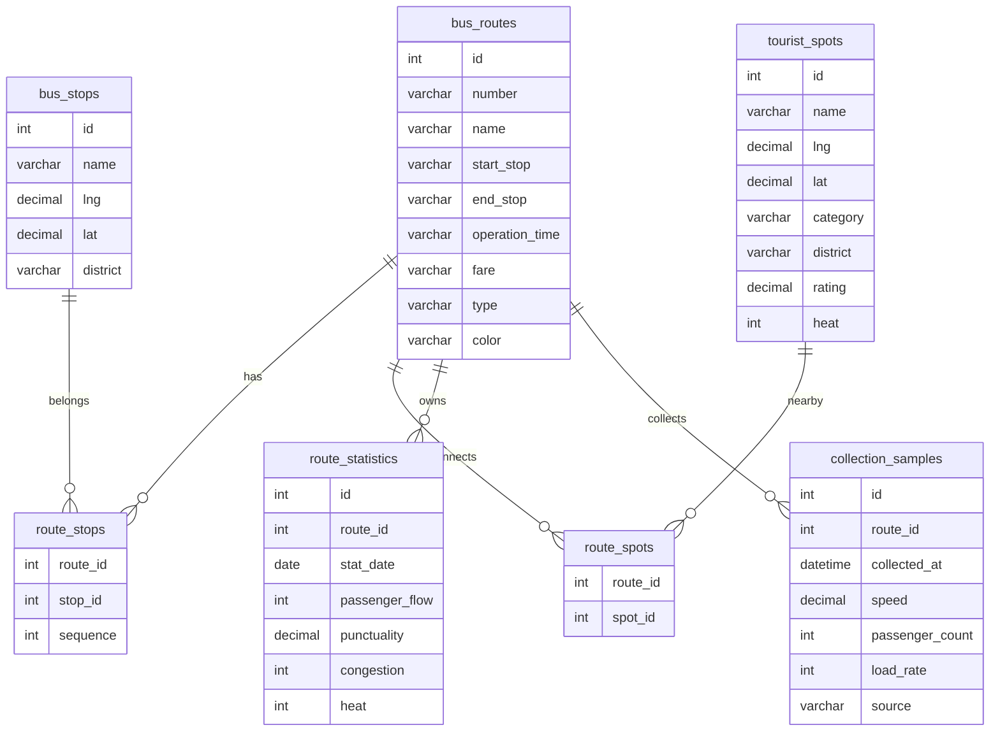

# 数据库设计

| 项目 | 内容 |
| --- | --- |
| 文档版本 | V3.2 |
| 更新日期 | 2026-05-26 |
| 适用范围 | 昆明公交旅游路线数据可视化系统 |
| 数据库 | MySQL 8.0 (kunming_bus_tour) |
| 字符集 | utf8mb4 / utf8mb4_unicode_ci |

## 目录

- [1. ER 关系](#1-er-关系)
- [2. 核心表说明](#2-核心表说明)
- [3. 采集样本表详细设计](#3-采集样本表详细设计)
- [4. 索引设计建议](#4-索引设计建议)
- [5. 初始化脚本](#5-初始化脚本)
- [6. 数据可信度说明](#6-数据可信度说明)

---

## 1. ER 关系



**关系说明：**

| 关系 | 类型 | 说明 |
| --- | --- | --- |
| `bus_routes` -- `route_stops` | 一对多 | 一条线路包含多个站点关联记录 |
| `bus_stops` -- `route_stops` | 一对多 | 一个站点可被多条线路引用 |
| `bus_routes` -- `route_spots` | 一对多 | 一条线路关联多个景点 |
| `tourist_spots` -- `route_spots` | 一对多 | 一个景点可被多条线路推荐 |
| `bus_routes` -- `route_statistics` | 一对多 | 一条线路有多条统计记录（按日期） |
| `bus_routes` -- `collection_samples` | 一对多 | 一条线路有多个采集样本 |

`route_stops` 和 `route_spots` 均为多对多关联的中间表。`route_stops` 额外携带 `sequence` 字段，表示站点在线路中的途经顺序（从 1 开始递增）。

---

## 2. 核心表说明

| 表名 | 用途 | 说明 |
| --- | --- | --- |
| `bus_routes` | 线路主表 | 保存公交线路基础信息，包括编号、名称、起终点、运营时间、票价、线路类型和地图渲染颜色 |
| `bus_stops` | 站点主表 | 保存公交站点名称、经纬度坐标和所属行政区 |
| `tourist_spots` | 景点主表 | 保存昆明旅游景点信息，包括名称、坐标、类型、行政区、评分、热度和简介 |
| `route_stops` | 线路-站点关联 | 保存线路与站点的多对多关系，`sequence` 字段记录途经顺序（联合主键 `route_id + stop_id`） |
| `route_spots` | 线路-景点关联 | 保存线路与推荐景点的多对多关系（联合主键 `route_id + spot_id`） |
| `route_statistics` | 线路运营统计 | 保存按日期维度的仿真运营指标：客流量、准点率、拥挤度、热度。唯一约束 `(route_id, stat_date)` 保证每天每线路只有一条记录 |
| `collection_samples` | 采集样本记录 | 保存模拟车载终端或人工补录的实时运行数据，是所有动态指标的计算数据源 |

> 详细字段定义请参见数据字典文档：[`../database/数据字典.md`](../database/数据字典.md)

---

## 3. 采集样本表详细设计

`collection_samples` 是整个动态可视化系统的数据源头。每次采集行为（自动采集器或手动补录）都会向该表写入一条记录，后端客流仿真模型随后读取最近样本重新计算运营指标。

### 3.1 表结构

| 字段 | 类型 | 约束 | 说明 |
| --- | --- | --- | --- |
| `id` | INT | PK, AUTO_INCREMENT | 样本主键 |
| `route_id` | INT | NOT NULL, FK → `bus_routes.id` | 关联公交线路，用于按线路统计和筛选 |
| `collected_at` | DATETIME | NOT NULL | 记录数据产生时间，驱动趋势图时间轴 |
| `speed` | DECIMAL(5,2) | NOT NULL | 车辆速度（km/h），反映运行状态 |
| `passenger_count` | INT | NOT NULL | 车内客流人数，反映实时载客量 |
| `load_rate` | INT | NOT NULL | 满载率百分比（0-100），反映拥挤程度 |
| `source` | VARCHAR(64) | NOT NULL | 数据来源标识，区分自动采集、人工补录和不同模拟终端 |

### 3.2 数据来源枚举

`source` 字段的可能取值：

| source 值 | 含义 |
| --- | --- |
| `GPS轨迹终端` | 模拟车载 GPS 自动上报 |
| `车载客流传感器` | 模拟车内容量传感器 |
| `人工补录` | 用户在"数据采集"页手动提交的样本 |
| `模拟采集终端` | 全局自动采集器生成的默认样本 |

### 3.3 外键与约束

```sql
CONSTRAINT fk_collection_samples_route
  FOREIGN KEY (route_id) REFERENCES bus_routes(id) ON DELETE CASCADE
```

采集样本通过 `route_id` 外键严格关联已有线路。当线路被删除时，其关联的所有采集样本级联删除（`ON DELETE CASCADE`），保证数据一致性。

---

## 4. 索引设计建议

### 4.1 已有索引（从 DDL 推导）

| 表 | 索引/约束 | 类型 | 字段 |
| --- | --- | --- | --- |
| `bus_routes` | PRIMARY | 主键 | `id` |
| `bus_stops` | PRIMARY | 主键 | `id` |
| `tourist_spots` | PRIMARY | 主键 | `id` |
| `route_stops` | PRIMARY | 联合主键 | `(route_id, stop_id)` |
| `route_spots` | PRIMARY | 联合主键 | `(route_id, spot_id)` |
| `route_statistics` | PRIMARY | 主键 | `id` |
| `route_statistics` | uk_route_date | 唯一索引 | `(route_id, stat_date)` |
| `collection_samples` | PRIMARY | 主键 | `id` |
| `collection_samples` | idx_collection_route_time | 普通索引 | `(route_id, collected_at)` |

### 4.2 推荐补充索引

以下索引在数据量增大时建议添加，以优化常见查询路径：

| 表 | 建议索引 | 类型 | 适用查询场景 |
| --- | --- | --- | --- |
| `bus_routes` | `idx_routes_number` ON `(number)` | 普通索引 | 按线路编号精确查找 |
| `bus_stops` | `idx_stops_district` ON `(district)` | 普通索引 | 按行政区筛选站点 |
| `tourist_spots` | `idx_spots_category` ON `(category)` | 普通索引 | 按景点类型分类查询 |
| `tourist_spots` | `idx_spots_district` ON `(district)` | 普通索引 | 按行政区筛选景点 |
| `route_statistics` | `idx_stats_date` ON `(stat_date)` | 普通索引 | 按日期范围查询统计 |
| `collection_samples` | `idx_samples_collected` ON `(collected_at)` | 普通索引 | 按采集时间范围筛选 |

### 4.3 索引优化说明

- `collection_samples` 已有复合索引 `(route_id, collected_at)`，可覆盖"按线路 + 时间范围查询最近样本"这一最高频查询。
- `route_statistics` 的唯一索引 `(route_id, stat_date)` 同时可用于按线路筛选，无需额外建立单列索引。
- 所有外键列（`route_id`, `stop_id`, `spot_id`）在 InnoDB 引擎下会自动创建索引，无需手动声明。

---

## 5. 初始化脚本

| 脚本文件 | 说明 |
| --- | --- |
| `database/schema.sql` | 创建数据库、建表语句、外键约束和索引。按依赖顺序执行：先主表后关联表，先删后建（幂等） |
| `database/seed.sql` | 初始化种子数据：10 条旅游相关线路、28 个站点、12 个景点、线路站点关联关系、线路景点关联关系和初始运营统计指标 |

执行方式：

```bash
mysql -u root -p < database/schema.sql
mysql -u root -p < database/seed.sql
```

---

## 6. 数据可信度说明

本项目为教学实训项目，数据来源与可信度如下：

| 数据类别 | 可信度 | 说明 |
| --- | --- | --- |
| 线路基础名称 | 中等 | 来自昆明公交和旅游公开资料人工整理，经校对但可能存在过时信息 |
| 站点与景点坐标 | 较低（近似） | 参考公开地图资料后人工校准，为教学可视化近似坐标，不可作为真实导航依据 |
| 运营统计指标 | 仿真数据 | 由客流仿真模型按业务规则计算生成，不代表真实客流数据 |
| 采集样本 | 模拟数据 | 由全局自动采集器按概率分布生成，用于演示"采集-入库-分析-可视化"全链路 |

项目完整保留了企业数据工程中的数据流转结构：数据源、采集接口、持久化表、统计计算和可视化展示，适合实训答辩时说明数据工程流程，但所有数值均不可直接用于生产决策。
