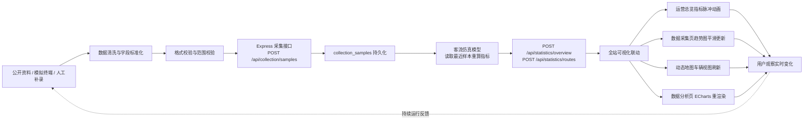

# 数据采集方案

| 项目 | 内容 |
| --- | --- |
| 文档版本 | V3.2 |
| 更新日期 | 2026-05-26 |
| 适用范围 | 昆明公交旅游路线数据可视化系统 |
| 编写目的 | 说明数据来源、采集流程、入库规则、质量控制和演示口径 |
| 数据性质 | 公开资料整理数据 + 教学仿真运营数据 |

## 目录

- [1. 采集目标](#1-采集目标)
- [2. 数据来源](#2-数据来源)
- [3. 采集流程](#3-采集流程)
- [4. 入库字段](#4-入库字段)
- [5. 数据质量控制](#5-数据质量控制)
- [6. 全新特性：实时可视化反馈联动](#6-全新特性实时可视化反馈联动)
- [7. 自动采集器设计](#7-自动采集器设计)
- [8. 企业化说明口径](#8-企业化说明口径)

---

## 1. 采集目标

本项目面向实训场景，需要体现从数据产生、接口上报、数据库保存到前端可视化展示的完整链路。采集目标包括：

- **公交线路基础数据**：线路编号、线路名称、起点、终点、运营时间、票价、线路类型。
- **公交站点空间数据**：站点名称、经度、纬度、所属行政区。
- **旅游景点数据**：景点名称、坐标、类型、行政区、评分、热度和简介。
- **线路运营统计数据**：客流量、准点率、拥挤度、热度。
- **实时采集样本数据**：采集时间、线路、车辆速度、车内人数、满载率、采集来源。
- **线路路径数据**：通过高德 Driving API 获取的线路实际行驶路径坐标串，用于地图真实轨迹渲染。

---

## 2. 数据来源

| 数据类别 | 来源方式 | 数据说明 | 使用限制 |
| --- | --- | --- | --- |
| 公交线路名称 | 昆明公交和旅游公开资料人工整理 | 用于构建项目业务主体 | 仅用于课程展示 |
| 站点与景点坐标 | 公开地图资料参考后人工校准 | 坐标为教学可视化近似值 | 不作为真实导航依据 |
| 线路行驶路径 | 高德 Driving API 离线采集 | 获取线路起点到终点的实际驾车路径 polyline | 需高德开发者 Key，按线路逐条采集后入库 |
| 运营统计指标 | 按业务规则构造的仿真数据 | 用于图表分析、排行展示 | 不代表真实客流 |
| 采集样本 | 全局自动采集器和手动补录 | 模拟车载终端持续上报 | 用于说明采集流程 |

### 2.1 高德 Driving API 路径采集说明

线路的真实行驶路径通过高德地图 Web 服务 Driving API 采集：

1. 调用 `GET https://restapi.amap.com/v3/direction/driving`，传入线路起点站和终点站坐标。
2. 解析返回的 `route.paths[0].steps` 中的 polyline 坐标串。
3. 将路径坐标数组存储至线路配置（`path` 字段），供前端地图组件（`Amap` 高德组件）渲染真实行驶轨迹。
4. 路径数据为离线一次性采集，不参与实时仿真动态计算。

> 相关配置详见：[`高德真实地图配置.md`](./高德真实地图配置.md)

---

## 3. 采集流程

### 3.1 整体数据流



### 3.2 基础数据整理流程

1. 收集昆明旅游公交相关线路、站点和景点资料。
2. 统一字段命名，整理为线路、站点、景点、关联关系四类数据。
3. 校验线路起终点、途经站点顺序、景点所属区域。
4. 将结构化数据写入初始化数据文件，MySQL 模式下通过 `schema.sql` 和 `seed.sql` 脚本入库。
5. 前端通过 `/api/routes`、`/api/stops`、`/api/spots` 获取展示数据。

### 3.3 运行样本采集流程

1. 前端"数据采集"页面点击"开始采集"。
2. 主应用启动全局采集器，切换页面后仍持续运行。
3. 采集器每约 1.5 秒选择多条线路，生成车辆速度、车内人数、满载率和来源。
4. 前端批量调用 `POST /api/collection/samples` 提交采集样本。
5. 后端完成字段类型转换、默认值处理和样本保存。
6. MySQL 模式下写入 `collection_samples` 表；file 模式下写入运行内存。
7. 后端客流仿真模型读取最近样本，重新计算客流、热度、拥挤度和准点率。
8. 全站所有可视化组件（运营总览指标卡、趋势图、地图、数据分析图表）同步刷新。

---

## 4. 入库字段

| 字段 | 类型 | 是否必填 | 规则 |
| --- | --- | --- | --- |
| `routeId` | number | 是 | 必须对应已有公交线路 |
| `collectedAt` | datetime | 否 | 为空时使用服务端当前时间 |
| `speed` | number | 是 | 单位 km/h，不能小于 0 |
| `passengerCount` | number | 是 | 车内人数，不能小于 0 |
| `loadRate` | number | 是 | 满载率百分比，范围 0-100 |
| `source` | string | 否 | 默认 "模拟采集终端" |

---

## 5. 数据质量控制

| 控制点 | 处理方式 |
| --- | --- |
| 字段完整性 | 接口层要求核心字段存在，缺省字段由服务端补默认值 |
| 类型一致性 | 后端将数字字段统一转换为 Number 类型 |
| 线路有效性 | MySQL 外键保证采集样本必须关联已有线路 |
| 时间一致性 | 未传采集时间时统一采用服务端时间 |
| 可追溯性 | `source` 字段记录采集来源，便于区分自动采集和人工补录 |
| 范围合理性 | `speed` 范围 0-120 km/h，`loadRate` 范围 0-100，超出范围自动截断 |

---

## 6. 全新特性：实时可视化反馈联动

V2.0 版本新增了全站实时可视化联动机制，采集数据不再仅影响后端统计数字，而是直接驱动前端所有可视化组件同步变化：

### 6.1 全站可视化联动

全局采集器启动后，以下页面组件全部进入实时刷新模式，无需手动刷新页面：

| 页面 | 联动组件 | 刷新频率 | 表现效果 |
| --- | --- | --- | --- |
| 运营总览 | 指标卡片（客流量、满载率、热度） | 5 秒 | 数字递增/递减动画，达到阈值时卡片边框脉冲 |
| 运营总览 | 热门线路排行 | 5 秒 | 排行条目平滑上移/下移，排名变化高亮闪烁 |
| 数据采集 | 最近采集记录表 | 2 秒 | 新记录从表顶插入，带滑入动画 |
| 数据采集 | 速度/满载率趋势图 | 2 秒 | ECharts 平滑追加数据点，X 轴自动滚动 |
| 动态地图 | 车辆位置标记 | 3 秒 | 标记沿线路路径移动，速度与采集 speed 成正比 |
| 数据分析 | 客流对比图、热力图 | 5 秒 | 图表平滑过渡渲染，避免突变跳变 |
| 线路详情 | 运营指标面板 | 5 秒 | 指标数值缓动变化，颜色随阈值渐变 |

### 6.2 指标脉冲动画

当某个指标变化幅度超过阈值时，对应的数值卡片触发脉冲动画：

- **客流量变化** > 20%：卡片边框橙色脉冲
- **拥挤度突破** 80%：卡片边框红色脉冲，持续 2 秒
- **热度排名变化**：排名数字闪烁，旧排名淡出、新排名滑入

### 6.3 图表平滑更新

ECharts 图表在接收到新数据时采用 `setOption` 的 `notMerge: false` 模式，结合 `animationDuration: 500` 实现数据点的平滑过渡，消除传统"整图刷新"的闪烁感。具体策略：

- **折线图/面积图**：`animationEasing: 'linear'`，新数据点沿 X 轴滑入
- **柱状图**：柱高平滑过渡，`animationDurationUpdate: 300`
- **饼图/环形图**：扇区角度渐变，`animationType: 'scale'`

---

## 7. 自动采集器设计

### 7.1 架构

全局采集器运行在主应用实例（`App.vue`）中，生命周期与主应用一致，不受路由切换影响：

```
App.vue (全局采集器实例)
  ├── 运营总览页面 (接收统计数据)
  ├── 数据采集页面 (控制采集启停 + 展示实时样本)
  ├── 动态地图页面 (接收车辆位置)
  ├── 数据分析页面 (接收图表数据)
  └── 线路详情页面 (接收单线路指标)
```

### 7.2 采集参数

| 参数 | 默认值 | 说明 |
| --- | --- | --- |
| 采集间隔 | ~1.5 秒 | 每次批量生成样本的间隔 |
| 每批线路数 | 3-5 条 | 每次随机选择的线路数量 |
| 速度范围 | 5-40 km/h | 模拟城市公交运行速度 |
| 客流范围 | 5-50 人 | 模拟车内乘客数 |
| 满载率范围 | 10-95% | 模拟车厢拥挤度 |

### 7.3 手动补录

除自动采集外，用户可在"数据采集"页面手动提交单条采集样本。手动补录允许自定义全部字段，`source` 自动标记为 `"人工补录"`。

---

## 8. 企业化说明口径

本项目未接入真实公交公司的实时车载设备，因此采集链路采用"模拟设备持续上报 + 手动补录"的方式实现。该方式保留了企业项目中常见的数据流转结构：数据源、采集接口、持久化表、统计接口和可视化页面，适合实训答辩时说明数据工程流程。

相比传统静态数据展示项目，本方案的优势在于：

1. **完整的数据链路闭环**：从采集到可视化全流程覆盖，而非仅做前端图表。
2. **全站实时联动**：一处数据变化驱动全站所有组件同步更新，展示企业级 Dashboard 特性。
3. **可演示的采集过程**：观众可在答辩现场实时看到数据产生、入库、统计和可视化的完整过程。
4. **可扩展的采集来源**：`source` 字段支持接入不同类型的模拟终端，便于扩展。
