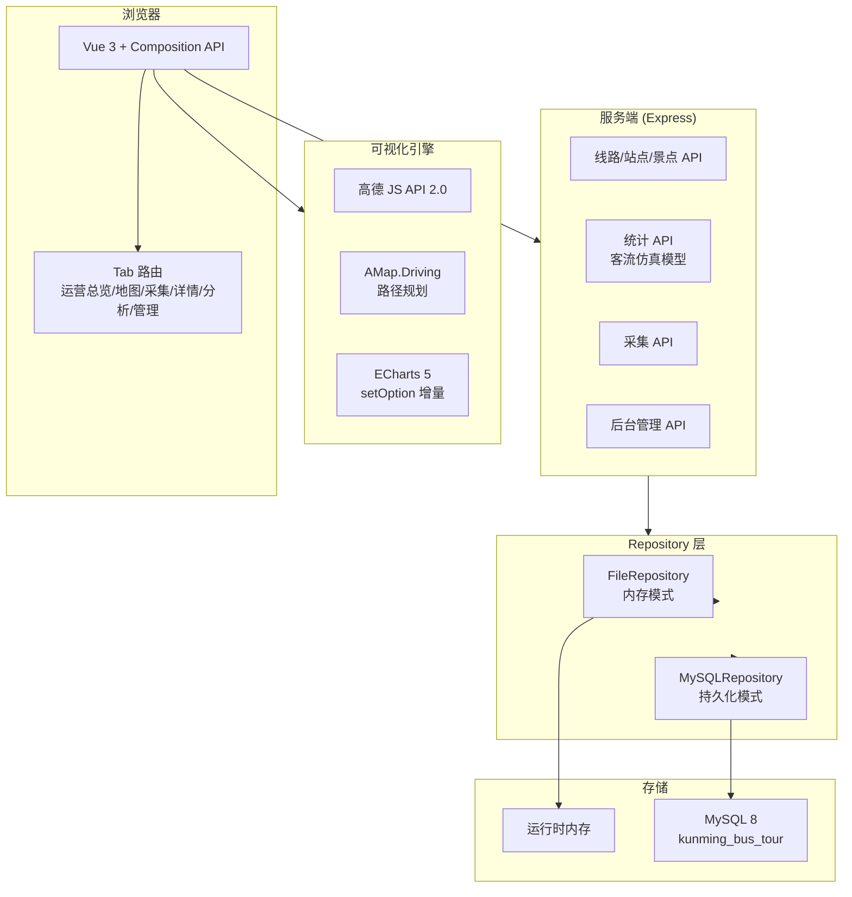
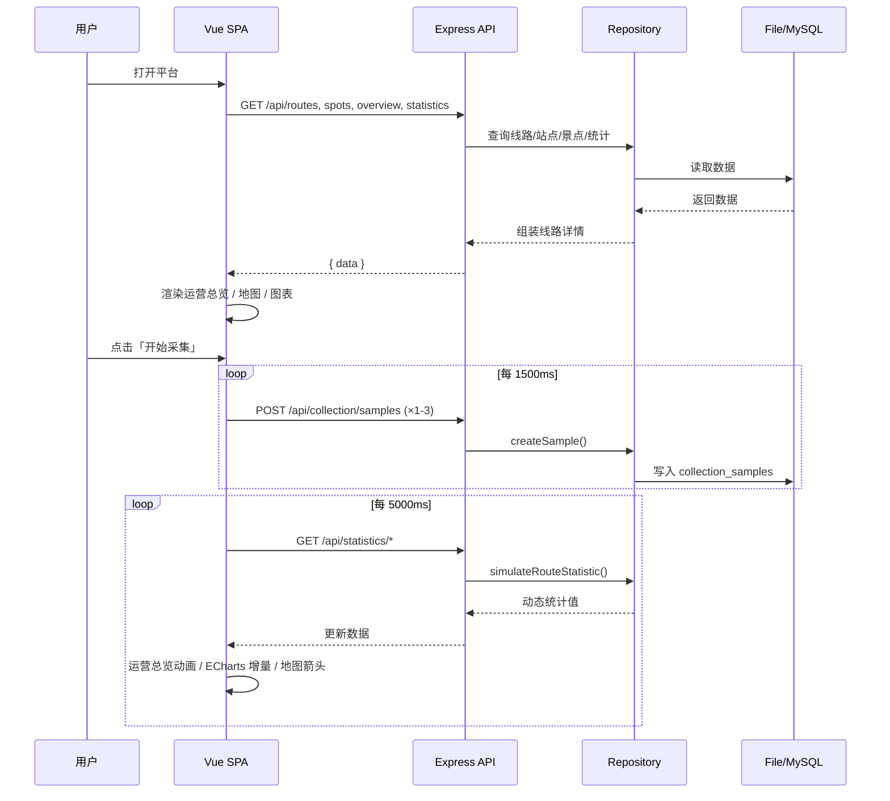

# 昆明公交旅游路线数据可视化平台 — 概要设计

| 属性 | 内容 |
| --- | --- |
| 文档编号 | KM-BUS-DESIGN-002 |
| 文档版本 | V3.2 |
| 上一版本 | V3.0（2026-05-13） |

---

## 1. 系统架构



---

## 2. 技术栈详情

| 层 | 选型 | 版本 | 用途 |
| --- | --- | --- | --- |
| 前端框架 | Vue 3 (Composition API) | 3.x | SPA 组件化开发 |
| 构建工具 | Vite | 5.x | 开发服务器 + 生产构建 |
| 类型系统 | TypeScript | 5.x | 静态类型检查 |
| 图表 | ECharts | 5.x | 客流/热度/拥挤度/采集趋势可视化 |
| 地图 | 高德 JS API | 2.0 | 3D 底图 + Driving 路线规划 |
| 后端框架 | Express.js | 4.x | REST API |
| 数据库驱动 | mysql2/promise | 3.x | MySQL 连接池 |
| 数据库 | MySQL | 8.0 | 持久化存储 |

---

## 3. 前后端交互流程



---

## 4. 核心模块设计

### 4.1 全局采集引擎（App.vue）

```
toggleCollector()
  ├─ collectorRunning = true → setInterval(runCollectorBatch, 1500)
  ├─ runCollectorBatch()
  │   ├─ 随机选取 ≤3 条线路
  │   ├─ 生成 speed/loadRate/passengerCount
  │   ├─ POST /api/collection/samples
  │   └─ refreshDynamicData() → 更新 routes/overview/statistics
  └─ collectorRunning = false → clearInterval
```

采集引擎在 App 层运行，Tab 切换不中断。`refreshDynamicData()` 静默捕获异常，保证单次网络波动不会破坏已有视图。

### 4.2 地图全线路引擎（MapView.vue）

```
onMounted()
  ├─ loadAmapScript() → 加载 AMap + Driving 插件
  ├─ renderAmap() → 初始化底图 + 备用路径渲染
  ├─ loadRealPathsForAllRoutes()
  │   └─ fetchDrivingPath() × 10 → AMap.Driving.search()
  │       起点 = stops[0], 终点 = stops[-1], 途经点 = stops[1:-2]
  │       → 提取 steps[].path → 保存到 realPaths
  ├─ startAnimation()
  │   └─ setInterval(140ms)
  │       遍历 routes:
  │         progress[i] += 0.0018 × speedFactor(telemetry[i].speed)
  │         updateAllBusArrows() → setPosition + setAngle
  └─ startPolling()
      ├─ 2500ms: loadTelemetry() → routeTelemetry
      └─ 8000ms: updateNearbyPois()
```

**路径优先级**：`realPaths[route.number]` → `routePathOverrides` → `route.polyline`

**渲染策略**：
- 全部线路始终渲染，非高亮线路 opacity=0.35, weight=4
- 高亮线路 opacity=0.92, weight=8, showDir=true
- 站点标记仅在高亮线路上显示
- 箭头尺寸：高亮 32px / 普通 22px

### 4.3 客流仿真模型（fileRepository.js）— Gravity Model v2

**核心公式（改进重力模型）：**

```text
PassengerFlow(route) = Σᵢⱼ T_ij × gravityScale × typeFactor × seasonality × holiday × hourFactor × spatialCompetition × noise

其中：
  T_ij = M_i × M_j × d_ij^(-γ)    （OD 对重力流量）
  M_i  = 出发站行政区人口-就业复合指数（五华 2.06, 盘龙 1.88, 官渡 2.04, 西山 1.61, 呈贡 1.23）
  M_j  = 目的站行政区指数 + Σ 2km 内景点吸引力(heat^0.40 × rating^0.35 × connectivity^0.25)
  γ    = 1.25 (旅游线路) / 0.85 (常规线路)     — 距离衰减指数
  d_ij = 站点间空间距离 (km)
```

**模型学术依据：**
- Zhao et al. (2024, *Sustainability*): 重力模型核心，出发地 GDP ↑10% → 旅游流 ↑0.88%，距离 ↑100km → 旅游流 ↓5.56%
- Yang et al. (2023, *JTR*): 距离衰减随出行类型变化，旅游出行对距离更敏感
- Rong et al. (2023): 介入机会理论，空间竞争因子
- Zhou et al. (2025) & Ren et al. (2025, *TRR*): 节假日客流放大 37-50%

**采集数据融合：** `finalFlow = modelFlow × 0.65 + observedFlow × 0.35`（指数平滑 α=0.35）

### 4.4 可视化联动机制

| 触发 | 数据流 | 视觉反馈 |
| --- | --- | --- |
| 采集器写入样本 | collection_samples 增加 → summary 变化 | 采集页样本数脉冲、趋势图增量更新 |
| refreshDynamicData | statistics/routes 重新计算 | 运营总览客流数字动画、热门排行重排 |
| routeTelemetry 更新 | 各线路最新样本 | 地图箭头速率变化、遥测面板刷新 |
| ECharts watch | statistics 引用变化 | `setOption` 增量渲染 + cubicOut 动画 |

---

## 5. 降级策略

| 场景 | 行为 |
| --- | --- |
| `VITE_AMAP_KEY` 未配置 | `fallback=true`，使用内置 SVG 地图 + 备用路径 |
| AMap 脚本加载失败 | `catch` → 显示错误原因 + SVG 降级 |
| Driving 插件不可用 | 跳过真实路径获取，使用 `routePathOverrides` 备用路径 |
| fetchDrivingPath 单条失败 | 该线路回退备用路径，其余线路正常 |
| API 刷新失败 | 静默捕获，保留上次有效数据不刷新 |

---

## 6. 数据模式切换

```text
backend/.env → DATA_MODE=file → FileRepository（内存 CRUD）
backend/.env → DATA_MODE=mysql → MySQLRepository（MySQL 持久化）
```

前后端接口不变，Repository 接口签名一致。默认使用 `file` 模式以便课堂快速演示。MySQL 模式下需先执行 `schema.sql` 和 `seed.sql`。
