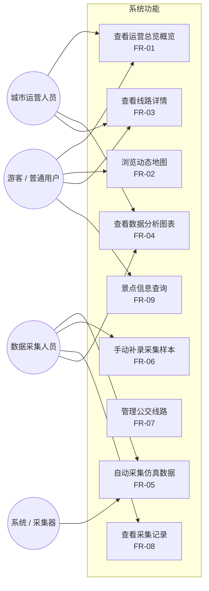

# 昆明公交旅游路线数据可视化平台 -- 需求分析

| 属性 | 内容 |
| --- | --- |
| 文档编号 | KM-BUS-REQ-002 |
| 文档版本 | V3.2 |
| 上一版本 | V3.0（2026-05-13） |

## 目录

- [1. 项目背景](#1-项目背景)
- [2. 用户角色](#2-用户角色)
- [3. 用例图](#3-用例图)
- [4. 用户故事矩阵](#4-用户故事矩阵)
- [5. 功能需求](#5-功能需求)
  - [5.1 运营总览](#51-运营总览)
  - [5.2 动态地图](#52-动态地图)
  - [5.3 线路详情](#53-线路详情)
  - [5.4 数据分析](#54-数据分析)
  - [5.5 数据采集](#55-数据采集)
  - [5.6 后台管理](#56-后台管理)
- [6. 非功能性需求](#6-非功能性需求)
- [7. 数据说明](#7-数据说明)
- [8. 验收矩阵](#8-验收矩阵)

---

## 1. 项目背景

昆明作为旅游城市，公交线路承担着连接翠湖、滇池、民族村、世博园、斗南花市等核心景点的出行功能。但公交数据通常分散在不同系统中，游客和运营人员缺乏统一的可视化入口。

本项目构建一个 **面向展示与教学的数据可视化平台**，通过模拟真实车载终端上报数据、集成高德地图路径规划、构建多因子客流仿真模型，实现对昆明公交旅游线路的全息监控与数据分析。

---

## 2. 用户角色

| 角色 | 核心诉求 |
| --- | --- |
| 游客 | 查看景点周边公交线路，判断最佳出行路线 |
| 城市运营人员 | 通过客流、热度、拥挤度指标识别重点保障线路 |
| 数据采集人员 | 执行自动采集任务，进行异常样本人工补录 |
| 系统 / 采集器 | 自动模拟车载终端上报数据，驱动客流仿真模型持续运行 |
| 企业导师 / 评审 | 评估项目是否具备规范的工程结构、数据库设计和交付文档 |
| 项目展示人员 | 通过运营总览、地图、图表全面展示前后端能力 |

---

## 3. 用例图

---

## 4. 用户故事矩阵

| 角色 | 需求描述 | 功能模块 | 关联需求编号 | 优先级 |
| --- | --- | --- | --- | --- |
| 游客 | 我想在首页看到线路总数、客流和热门排行 | 运营总览 | F-DB-01, F-DB-03 | **P0** |
| 游客 | 我想在地图上直观看到所有线路、站点和景点位置 | 动态地图 | F-MP-01 ~ F-MP-10 | **P0** |
| 游客 | 我想查看某条线路的起终点、票价、途经站点和附近景点 | 线路详情 | F-DL-01 ~ F-DL-04 | **P0** |
| 游客 | 我想看到景点的真实图片、分类和详细介绍 | 动态地图 / 景点 | F-MP-08 | **P1** |
| 运营人员 | 我想在图表中比较各线路的客流、拥挤度和准点率 | 数据分析 | F-AN-01 ~ F-AN-06 | **P0** |
| 运营人员 | 我想知道站点在不同行政区的分布情况 | 数据分析 | F-AN-03 | **P1** |
| 运营人员 | 我想新增和删除线路数据 | 后台管理 | F-AD-01, F-AD-02 | **P1** |
| 采集人员 | 我想一键启动自动采集任务，模拟真实数据上报 | 数据采集 | F-CL-01 | **P0** |
| 采集人员 | 我想在趋势图中实时观察采集数据变化 | 数据采集 | F-CL-03, F-CL-04 | **P0** |
| 采集人员 | 我想手动补录异常或特殊样本 | 数据采集 | F-CL-02 | **P1** |
| 系统 | 采集样本应驱动客流模型重算，实现全站数据联动 | 客流模型 | F-CL-01 ~ F-CL-04 | **P0** |
| 系统 | 无高德 Key 或无 MySQL 时应自动降级保证可用 | 容错降级 | F-MP-10, NF-01 | **P0** |
| 项目评审 | 项目应交付需求、设计、接口、数据库、采集、测试、总结共 7 份以上文档 | 文档交付 | NF-04 | **P0** |

> 优先级定义：**P0** = 核心功能，必须实现；**P1** = 重要功能，提升体验；**P2** = 锦上添花，可选。

---

## 5. 功能需求

### 5.1 运营总览

| 编号 | 需求 | 描述 | 优先级 |
| --- | --- | --- | --- |
| F-DB-01 | 核心指标面板 | 展示线路总数、站点总数、景点总数、动态仿真客流（含数字滚动动画） | **P0** |
| F-DB-02 | 实时状态指示 | 采集器运行时显示"实时仿真"呼吸灯徽标，指标面板显示蓝色光晕脉冲 | **P1** |
| F-DB-03 | 热门线路排行 | TOP 5 线路按热度排序，采集数据驱动排名变化 | **P0** |
| F-DB-04 | 客流模型说明 | 展示当前使用的仿真因子链，采集器运行时标注"采集因子生效中" | **P1** |
| F-DB-05 | 路线卡片 | 全部线路的概览卡片，点击进入线路详情 | **P0** |

### 5.2 动态地图

| 编号 | 需求 | 描述 | 优先级 |
| --- | --- | --- | --- |
| F-MP-01 | 高德 3D 底图 | 接入高德 JS API 2.0，展示昆明区域真实道路、建筑、地名 | **P0** |
| F-MP-02 | 真实道路路径 | 通过 AMap.Driving 获取驾车路径，线路沿真实道路弯曲渲染，拒绝直线穿湖穿楼 | **P0** |
| F-MP-03 | 多线路同步运行 | 全部线路同时显示，每条线路上一个彩色导航箭头独立移动 | **P0** |
| F-MP-04 | 导航箭头 | 使用 SVG chevron 箭头（指向运动方向），直观标识每条线路的当前车辆位置 | **P0** |
| F-MP-05 | 高亮交互 | 点击线路，该线路高亮（完整不透明度 + 大箭头 + 站点出现）、其余线路淡化 | **P0** |
| F-MP-06 | 遥测面板 | 高亮线路显示实时速度/人数/满载率，未高亮时显示总览统计 | **P1** |
| F-MP-07 | 周边 POI | 高亮线路箭头当前位置附近的站点和景点，随箭头移动自动刷新 | **P1** |
| F-MP-08 | 景点详情 | 点击景点标记展示真实图片、分类、评分、介绍 | **P1** |
| F-MP-09 | 速度联动 | 箭头移动速率由该线路最新采集样本的 `speed` 字段驱动 | **P1** |
| F-MP-10 | 降级展示 | 未配置高德 Key 时使用内置 SVG 地图 + 备用路径，保证演示不中断 | **P0** |

### 5.3 线路详情

| 编号 | 需求 | 描述 | 优先级 |
| --- | --- | --- | --- |
| F-DL-01 | 线路基础信息 | 展示线路编号、名称、起终点、运营时间、票价、类型 | **P0** |
| F-DL-02 | 站点时间线 | 按顺序展示途经站点 | **P0** |
| F-DL-03 | 运营指标 | 客流、准点率、拥挤度、热度面板（采集驱动变化） | **P1** |
| F-DL-04 | 关联景点 | 线路经过的旅游景点列表 | **P1** |

### 5.4 数据分析

| 编号 | 需求 | 描述 | 优先级 |
| --- | --- | --- | --- |
| F-AN-01 | 客流排行柱状图 | 全部线路按客流降序，采集数据驱动柱子高度变化 | **P0** |
| F-AN-02 | 景点热度排行 | TOP 8 景点热度柱状图 | **P1** |
| F-AN-03 | 区域分布饼图 | 站点按行政区（五华/盘龙/官渡/西山/呈贡）的环形占比图 | **P1** |
| F-AN-04 | 拥挤度-准点率双线图 | 全部线路的双指标对比 | **P0** |
| F-AN-05 | 平滑动画 | 所有图表使用 `setOption` 增量更新，带 400-600ms 过渡动画，无销毁重建闪烁 | **P1** |
| F-AN-06 | 采集指示 | 采集器运行时显示"采集中"徽标 | **P1** |

### 5.5 数据采集

| 编号 | 需求 | 描述 | 优先级 |
| --- | --- | --- | --- |
| F-CL-01 | 自动采集引擎 | 点击开始后持续运行，每 1.5s 批量生成 1-3 条线路样本，切换页面不中断 | **P0** |
| F-CL-02 | 手动补录 | 表单选择线路、填写速度/人数/满载率/来源，提交后全站联动 | **P1** |
| F-CL-03 | 实时趋势图 | ECharts 展示最近 18 条样本的满载率（线）、人数（柱）、速度（线），`setOption` 增量更新 | **P0** |
| F-CL-04 | 遥测指标面板 | 样本总数、在线设备、平均速度、平均满载率，值变化时触发脉冲动画 | **P0** |
| F-CL-05 | 最近记录表 | 最近 8 条采集记录，每 2s 自动刷新 | **P1** |

### 5.6 后台管理

| 编号 | 需求 | 描述 | 优先级 |
| --- | --- | --- | --- |
| F-AD-01 | 新增线路 | 填写线路编号、名称、起终点、运营时间、票价、类型、颜色 | **P1** |
| F-AD-02 | 删除线路 | 从列表中删除已有线路 | **P1** |

---

## 6. 非功能性需求

### NF-01 稳定性与容错

| 指标 | 要求 | 优先级 |
| --- | --- | --- |
| 地图降级 | 无高德 Key 时前端自动降级至内置 SVG 演示地图，所有功能不受影响 | **P0** |
| 数据库降级 | 无 MySQL 时系统自动使用 file 模式（JSON 文件），所有接口正常工作 | **P0** |
| 接口容错 | 单次网络请求失败时前端保留上一次有效数据，不出现白屏或空状态 | **P1** |
| 图片容错 | 景点真实图片加载失败时自动回退至 SVG 占位图，保证无裂图 | **P1** |

### NF-02 性能

| 指标 | 目标值 | 测量方式 |
| --- | --- | --- |
| 首次内容绘制 (FCP) | < 2.5 秒 | Chrome DevTools Lighthouse（开发模式） |
| 接口响应时间 (P95) | < 500 ms | 本地 `localhost` 环境，排除首次冷启动 |
| 地图动画帧率 | 约 7 FPS（每 140 ms 更新） | `setInterval` 间隔 140 ms |
| ECharts 渲染延迟 | < 400 ms | 增量更新 `setOption`，禁止全量销毁重建 |
| 采集器批量写入 | 每 1.5 s 写入 1-3 条 | `setInterval` 间隔 1500 ms |
| 全站统计刷新 | 每 5 s 拉取一次 | `setInterval` 间隔 5000 ms |

### NF-03 可用性与展示性

| 指标 | 要求 | 优先级 |
| --- | --- | --- |
| 响应式布局 | 适配桌面端（>= 1024px）与平板端（>= 768px），移动端可折叠侧边栏 | **P1** |
| 零配置启动 | 执行 `npm run install:all` 后两条命令即可同时启动前后端 | **P0** |
| 演示连续性 | 采集器全局运行于主应用层，切换页面不中断，无需评审人员反复操作 | **P0** |
| 数据驱动可视化 | 所有图表和指标均由后端实时数据驱动，非静态写死文字和数字 | **P0** |

### NF-04 可维护性与规范性

| 指标 | 要求 | 优先级 |
| --- | --- | --- |
| 前后端分离 | 前端 Vue 3 + Vite + TypeScript，后端 Express + Node.js，通过 REST API 通信 | **P0** |
| Repository 抽象层 | 数据访问层支持 `file` 和 `mysql` 双模式，通过接口切换，无需修改业务代码 | **P0** |
| 文档完整性 | 交付需求分析、概要设计、接口文档、数据库设计、数据采集方案、测试报告、项目总结共 7 份以上文档 | **P0** |
| 代码规范 | 后端 CommonJS 模块化 + 参数校验；前端 TypeScript + Vue 3 Composition API + 类型定义 | **P1** |

### NF-05 可追溯性

| 指标 | 要求 | 优先级 |
| --- | --- | --- |
| 采集样本字段 | 记录 `collectedAt`（采集时间）、`source`（采集来源）、`routeId`（关联线路） | **P0** |
| 客流模型可解释 | 公式公开，统计输出与输入样本之间存在可验证的因果关系 | **P1** |
| 高德路径可验证 | 真实路径由 Driving API 在线规划，非手动描点 | **P0** |

---

## 7. 数据说明

- 线路名称、站点和景点参考昆明公开公交/旅游资料整理。
- 经纬度为教学项目可视化近似坐标，非生产级精确定位。
- 客流、准点率、拥挤度、热度为多因子仿真模型的输出指标，公式可参阅 [动态数据模型说明](./动态数据模型说明.md)。
- 采集样本由全局采集引擎生成，模拟车载 GPS + 客流传感器上报。
- 高德真实道路路径（高亮线路）通过 `AMap.Driving` 在线规划获取。

---

## 8. 验收矩阵

| 编号 | 验收项 | 标准 | 对应需求 |
| --- | --- | --- | --- |
| A01 | 全线路真实路径 | 全部线路在高德底图上沿真实道路渲染，不出现直线穿湖穿楼 | F-MP-02 |
| A02 | 多箭头同步运行 | 多个彩色箭头沿各自线路独立运动，速率与采集数据联动 | F-MP-03, F-MP-09 |
| A03 | 高亮与遥测 | 点击线路后高亮显示，遥测面板展示该线路实时采集数据 | F-MP-05, F-MP-06 |
| A04 | 采集联动 | 点击"开始采集"后全站指标和图表持续变化，切换页面不中断 | F-CL-01, F-CL-03, F-CL-04 |
| A05 | 图表平滑过渡 | 数据分析 ECharts 图表增量更新，动画无销毁重建闪烁 | F-AN-05 |
| A06 | 客流动态计算 | 连续调用 `/api/statistics/overview` 返回不同数值（非静态写死） | F-DB-01 |
| A07 | 降级可用 | 无高德 Key 时内置 SVG 地图仍可完整演示；无 MySQL 时 file 模式正常运行 | F-MP-10, NF-01 |
| A08 | 文档齐全 | 7 类以上交付文档，格式规范、内容完整 | NF-04 |

---

> 相关文档：
> - [概要设计](./概要设计.md)
> - [接口文档](./接口文档.md)
> - [数据库设计](./数据库设计.md)
> - [数据采集方案](./数据采集方案.md)
> - [测试报告](./测试报告.md)
> - [动态数据模型说明](./动态数据模型说明.md)
